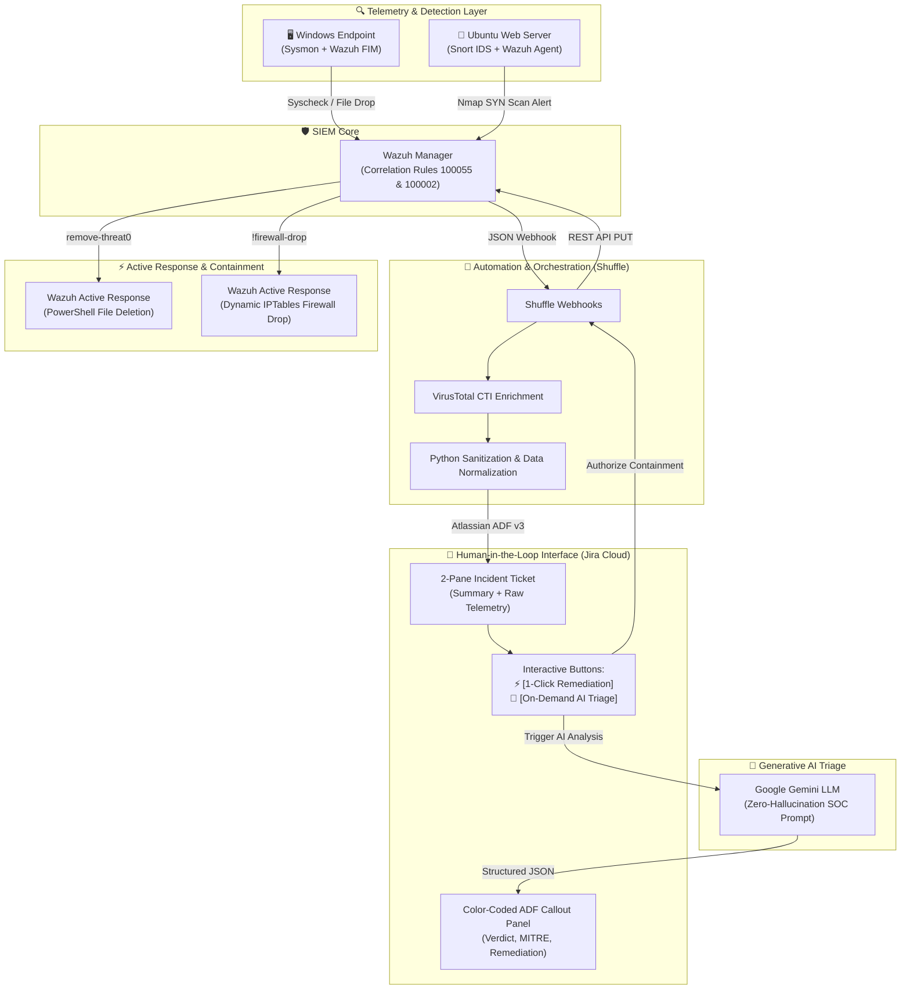
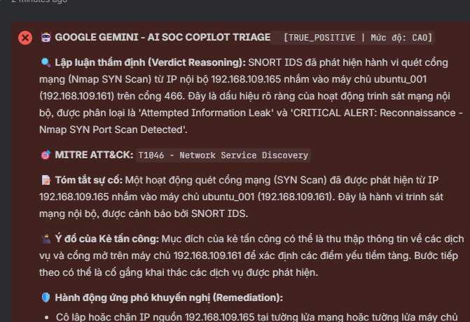

# 🛡️ Enterprise Automated SOC & AI-Powered Incident Response Platform (SOAR Lab)

[](https://wazuh.com/)
[](https://shuffler.io/)
[](https://www.atlassian.com/software/jira)
[](https://ai.google.dev/)
[](https://www.snort.org/)
[](https://attack.mitre.org/)

---

## 📌 Executive Summary

Traditional Security Operations Centers (SOCs) face two critical challenges:
1. **Alert Fatigue:** Tier 1 analysts are overwhelmed by thousands of disconnected alerts daily.
2. **The "Blast Radius" of Unchecked Automation:** Fully autonomous response scripts (e.g., auto-quarantining critical servers or auto-blocking internal IP addresses) can cause severe production outages.

This project implements an **Enterprise-grade, Human-in-the-Loop (HitL) Security Orchestration, Automation, and Response (SOAR) ecosystem**. By interconnecting **Wazuh SIEM**, **Snort NIDS**, **Shuffle SOAR**, **Atlassian Jira Cloud**, and **Google Gemini LLM**, this lab demonstrates how modern SecOps teams can automate triage, enrich alerts with Cyber Threat Intelligence (CTI), generate structured incident tickets, and empower analysts to trigger verified remediation with 1-click authorization.

---

## 🏛️ End-to-End System Architecture



---

## 🚀 Key Incident Response Playbooks

### Playbook 1: Endpoint Malware Detection & Containment
* **Attack Scenario:** A malicious executable (`eicar.com` / `mimikatz.exe`) is downloaded to `C:\Users\Public\Downloads`.
* **Detection:** Wazuh File Integrity Monitoring (FIM) detects file creation (Rule `100055`, Level 12).
* **SOAR Workflow:**
  1. Wazuh forwards alert to Shuffle via Webhook.
  2. Shuffle queries **VirusTotal API** for file reputation.
  3. Formats alert into an **Atlassian Document Format (ADF) 2-Pane Incident Ticket**:
     - **Pane 1:** High-level summary, host context, and remediation action banner.
     - **Pane 2:** Comprehensive technical telemetry dump for deep analysis.
  4. Analyst clicks **⚡ [☢️ APPROVE MALWARE DELETION]**.
  5. Shuffle invokes Wazuh REST API (`remove-threat0`), which executes a native PowerShell script on Windows to remove the malicious binary.
  6. Automated confirmation comment is posted back to Jira.

---

### Playbook 2: Network Reconnaissance & Dynamic Firewalling
* **Attack Scenario:** Attacker machine (Kali Linux) executes an aggressive stealth SYN port scan (`nmap -sS -p 1-1000 --min-rate 1000`) against the web server.
* **Detection:** **Snort IDS** detects threshold-breaking SYN packets without ACK (`local.rules`, SID `1000005`). Wazuh Agent captures log and triggers Rule `100002` (Level 12).
* **SOAR Workflow:**
  1. Shuffle extracts Attacker IP (`192.168.109.165`) and target telemetry.
  2. Jira ticket is automatically populated with packet details and MITRE mapping (`T1595.002`).
  3. SOC Analyst reviews alert and authorizes blocking via Jira manual trigger.
  4. Shuffle calls Wazuh REST API with `command: !firewall-drop`.
  5. Wazuh Agent dynamically inserts `iptables -I INPUT -s <Attacker_IP> -j DROP`.
  6. Subsequent attacker probes are completely dropped (`100% packet loss`).

---

### Playbook 3: On-Demand AI Incident Triage Copilot (Google Gemini)
* **Problem:** In complex alerts, junior analysts may struggle to correlate packet flags, MITRE techniques, and attack intent in under 60 seconds.
* **Solution:** An **interactive AI Copilot** embedded directly into Jira:
  1. Analyst clicks **`🤖 Hỏi AI SOC`** directly on any Jira alert ticket.
  2. Jira Automation dispatches ticket summary and raw telemetry to Shuffle.
  3. **Zero-Hallucination Prompting Engine:** The Python node wraps telemetry into an 8-rule strict prompt (banning fabricated IOCs, forcing evidence-based reasoning, and bounding intent strictly to observed data).
  4. **Google Gemini Flash** analyzes telemetry and outputs strict JSON:
     - `verdict`: `TRUE_POSITIVE` | `FALSE_POSITIVE` | `SUSPICIOUS`
     - `verdict_reasoning`: Technical justification based on TCP flags/ports.
     - `mitre_technique`: Verified MITRE technique ID and name.
     - `attacker_intent`: Probable objective and next staging step.
     - `remediation_actions`: 3-4 prioritized response actions.
  5. Shuffle converts JSON into an Atlassian ADF Callout Panel (Color-coded: 🔴 **Error/Red** for Critical/High, 🟡 **Warning/Yellow** for Suspicious, 🟢 **Success/Green** for False Positive) and posts it as an incident comment in **under 3 seconds**.

---

## 📸 Proof of Work & Verification

| Component | Screenshot & Description |
| :--- | :--- |
| **Interactive AI Triage in Jira** | <br/>*Rich ADF Callout Panel automatically generated by Google Gemini inside Jira Ticket.* |
| **2-Pane Jira Ticket Architecture** | *Pane 1 (Actionable metadata & 1-click button) + Pane 2 (Full technical log telemetry).* |
| **Active Response Verification** | *Linux `iptables -L -n` showing attacker IP in `DROP` chain with 100% packet drop.* |

---

## 🛠️ Repository Organization

```text
soc-soar-ai-lab/
├── README.md                          # Project documentation and architectural overview
├── docs/                              # Screenshots and visual proof of work
│   └── pb3_ai_soc_triage.png          # Live Jira AI Triage comment screenshot
├── configs/                           # Detection & SIEM configuration files
│   ├── wazuh/                         # Custom Wazuh rules & integration hooks
│   │   ├── local_rules.xml
│   │   └── ossec_integration.xml
│   ├── snort/                         # Snort NIDS detection rules
│   │   └── local.rules
│   └── sysmon/                        # Windows Sysmon configuration
│       └── sysmonconfig.xml
├── scripts/                           # Host-based Active Response scripts
│   ├── active_response/
│   │   ├── remove-threat.cmd          # Windows PowerShell file deletion wrapper
│   │   └── firewall-drop.sh           # Linux IPTables dynamic rule insertion
│   └── helpers/
│       └── gemini_prompt_builder.py   # Python string escaping & JSON sanitization
└── prompts/                           # System prompts for Generative AI
    └── soc_analyst_l3_prompt.md       # 8-Rule Zero-Hallucination Prompt Framework
```

---

## 🧠 Key Technical Challenges Solved

1. **Jira Cloud REST API v3 ADF Conformance:**
   - Jira Cloud v3 rejects plain-text strings in comments and descriptions, requiring deep Atlassian Document Format (`type: "doc"`). Solved by building an automated ADF JSON builder in Python handling nested panels, marks, and bullet lists.
2. **Preventing LLM Prompt Injection & JSON Breaking:**
   - Raw IDS and system logs contain unescaped double quotes, backslashes, and arbitrary newlines that easily break downstream HTTP payloads. Solved with a dedicated regex sanitizer (`.replace('\', '\\').replace('"', "'").replace('
', '\n')`).
3. **HTTP 406 Not Acceptable & Content Negotiation:**
   - Overcame Atlassian v3 gateway rejections by strictly enforcing `Accept: application/json` and `Content-Type: application/json` headers within SOAR HTTP modules.
4. **Snort Alert Cooldown & Threshold Tuning:**
   - Tuned Snort rule thresholds (`count 100, seconds 5`) to eliminate false-negative suppression windows while maintaining high-fidelity detection of Nmap stealth scans.

---

## 👨‍💻 Author & Contact

* **Role:** SOC Analyst / Security Automation Engineer
* **Core Skills:** SIEM/SOAR Architecture, Detection Engineering, Incident Response, Python Automation, Generative AI for SecOps.
