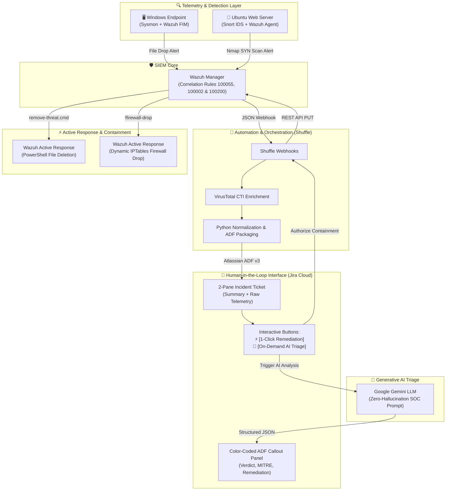

# 🛡️ Enterprise Automated SOC & AI-Powered Incident Response Platform (SOAR Lab)

[](https://wazuh.com/)
[](https://shuffler.io/)
[](https://www.atlassian.com/software/jira)
[](https://ai.google.dev/)
[](https://www.snort.org/)
[](https://attack.mitre.org/)
[](LICENSE)

---

## 📌 Executive Summary

Traditional Security Operations Centers (SOCs) face two critical challenges:
1. **Alert Fatigue:** Tier 1 analysts are overwhelmed by thousands of disconnected alerts daily.
2. **The "Blast Radius" of Unchecked Automation:** Fully autonomous response scripts (e.g., auto-quarantining critical servers or auto-blocking internal IP addresses) can cause severe production outages.

This project implements an **Enterprise-grade, Human-in-the-Loop (HitL) Security Orchestration, Automation, and Response (SOAR) ecosystem**. By interconnecting **Wazuh SIEM**, **Snort NIDS**, **Shuffle SOAR**, **Atlassian Jira Cloud**, and **Google Gemini LLM**, this lab demonstrates how modern SecOps teams can automate triage, enrich alerts with Cyber Threat Intelligence (CTI), generate structured incident tickets, and empower analysts to trigger verified remediation with 1-click authorization.

---

## 🏛️ End-to-End System Architecture



---

## 🚀 Incident Response Playbooks (Documentation Hub)

This repository adopts a modular **Hub & Spoke** documentation architecture. Click on each playbook card below to read the comprehensive technical case study, step-by-step screenshots, and evidence trails:

| Playbook | Threat Vector & Scope | Technology Stack | Detailed Case Study |
| :--- | :--- | :--- | :---: |
| **Playbook 1: OS Credential Dumping & AI Triage** | In-memory LSASS extraction via ProcDump (Atomic Red Team T1003.001). Sysmon Event ID 10 (`0x1fffff`), True Positive vs False Positive (`0x1410`) discrimination, and 6-step IR checklist. | Atomic Red Team, Sysmon, Wazuh SIEM, Shuffle SOAR, Jira Cloud, Google Gemini | 👉 **[📖 Read Case Study (14 Screenshots)](docs/playbooks/playbook_1_lsass_dump_defense.md)** |
| **Playbook 2: Network Reconnaissance Defense** | Aggressive stealth Nmap SYN scanning against web server. Snort NIDS detection, Level 12 SIEM correlation, 1-click authorization, and dynamic IPTables isolation (100% loss proof). | Snort 2.9, Wazuh SIEM, Shuffle SOAR, Jira Cloud, Linux IPTables | 👉 **[📖 Read Case Study (11 Screenshots)](docs/playbooks/playbook_2_nmap_defense.md)** |
| **Playbook 3: Endpoint Malware Containment (FIM)** | Real-time Trojan drop in Downloads (`lesson29.exe`). Wazuh FIM detection, VirusTotal CTI (30/71 engines), Google Gemini AI triage, and 1-click active response file deletion. | Wazuh Realtime FIM, VirusTotal API, Shuffle SOAR, Jira Cloud, Active Response | 👉 **[📖 Read Case Study (15 Screenshots: Attack vs Benign Gatekeeper)](docs/playbooks/playbook_3_malware_containment_fim.md)** |

---

## 📚 Technical Reference Guides & Artifacts

| Component | Description | Reference Link |
| :--- | :--- | :---: |
| **Shuffle SOAR Workflows** | 5 production JSON workflow templates ready for 1-click import into Shuffle SOAR (Cloud/Docker). | 👉 **[🔀 Explore Workflows](playbooks/shuffle_workflows/README.md)** |
| **Lab Network Topology & 16GB Setup** | Comprehensive IP addressing table, VM specifications, 16GB RAM budget optimization guide, and Wazuh webhook integration setup. | 👉 **[🌐 View Setup Guide](docs/lab_setup_topology.md)** |
| **MITRE ATT&CK Matrix** | End-to-end defensive coverage mapping across Reconnaissance, Credential Access, Execution, and Active Response. | 👉 **[🎯 View MITRE Matrix](docs/mitre_attack_matrix.md)** |
| **Attack Emulation Scripts** | Automated Bash and PowerShell scripts to safely simulate Nmap scans, LSASS memory dumping, and EICAR/malware file drops. | 👉 **[⚔️ View Scripts](scripts/attack_simulation/)** |

---

## 📸 Key Visual Proof of Work

| Interactive AI Triage (Google Gemini in Jira) | Containment Verification (100% Packet Loss) |
| :---: | :---: |
|  |  |
| *Structured ADF Callout Panel generated by Gemini in Jira.* | *Kali ICMP packets dropped: 60 sent, 0 received, 100% packet loss.* |

---

## 🛠️ Repository Organization

```text
soc-soar-ai-lab/
├── README.md                                  # Landing page & architectural overview (You are here)
├── LICENSE                                    # MIT Open-Source License
├── .gitignore                                 # Production SecOps credential & cache filtering
├── .env.example                               # Environment configuration template for API tokens
├── docs/
│   ├── lab_setup_topology.md                  # Network IP schema, 16GB RAM sizing & setup guide
│   ├── mitre_attack_matrix.md                 # Complete MITRE ATT&CK defensive mapping
│   ├── images/                                # 41 High-resolution lab evidence screenshots
│   └── playbooks/                             # Modular playbook case studies
│       ├── playbook_1_lsass_dump_defense.md   # LSASS credential dumping & AI triage
│       ├── playbook_2_nmap_defense.md         # Nmap defense & dynamic firewalling
│       └── playbook_3_malware_containment_fim.md # FIM malware detection & 1-click deletion
├── playbooks/
│   └── shuffle_workflows/                     # 5 Production Shuffle SOAR JSON templates
│       ├── README.md                          # Workflow import & configuration guide
│       ├── workflow_nmap_recon_detection.json # Nmap scan detection & VT enrichment
│       ├── workflow_nmap_firewall_block_ip.json # 1-Click IPTables firewall drop
│       ├── workflow_fim_malware_detection.json # FIM malware detection & VT gatekeeper
│       ├── workflow_fim_active_response_delete_file.json # 1-Click Windows file deletion
│       └── workflow_gemini_ai_soc_triage.json # On-demand Gemini AI triage with ADF panel
├── configs/                                   # Production-ready detection configurations
│   ├── wazuh/                                 # Custom correlation rules & webhook integrations
│   │   ├── local_rules.xml
│   │   └── ossec_integration.xml
│   ├── snort/                                 # Snort 2.9 thresholding rules
│   │   └── local.rules
│   └── sysmon/                                # Windows Sysmon event filtering
│       └── sysmonconfig.xml
├── scripts/
│   ├── active_response/                       # Host-level Active Response wrappers
│   │   ├── remove-threat.cmd                  # Windows PowerShell file deletion wrapper
│   │   └── firewall-drop.sh                   # Linux IPTables dynamic isolation wrapper
│   ├── attack_simulation/                     # Safe attack simulation scripts
│   │   ├── simulate_nmap_scan.sh              # Nmap SYN stealth scan simulation
│   │   ├── simulate_procdump_lsass.bat        # LSASS memory dump simulation
│   │   └── simulate_malware_drop.ps1          # Monitored folder payload drop simulation
│   └── helpers/
│       └── gemini_prompt_builder.py           # Python string escaping & JSON sanitization
└── prompts/                                   # Enterprise Generative AI prompts
    └── soc_analyst_l3_prompt.md               # 8-Rule Zero-Hallucination Prompt Framework
```

---

## 🧠 Key Technical Challenges Solved

1. **Jira Cloud REST API v3 ADF Conformance:**
   - Handled Atlassian's strict nested document schema (`type: "doc"`) for both incident tickets and rich color-coded comments without using brittle HTML.
2. **Preventing LLM Prompt Injection & JSON Breaking:**
   - Raw IDS and system logs contain unescaped double quotes, backslashes, and arbitrary newlines that easily break downstream HTTP payloads. Solved with a dedicated regex sanitizer (`.replace('\\', '\\\\').replace('"', "'").replace('\n', '\\n')`).
3. **HTTP 406 Not Acceptable & Content Negotiation:**
   - Overcame Atlassian v3 gateway rejections by strictly enforcing `Accept: application/json` and `Content-Type: application/json` headers within SOAR HTTP modules.
4. **Snort Alert Cooldown & Threshold Tuning:**
   - Tuned Snort rule thresholds (`count 100, seconds 5`) to eliminate false-negative suppression windows while maintaining high-fidelity detection of Nmap stealth scans.
5. **Eliminating SOAR Alert Fatigue via Threat Intel Gatekeeping:**
   - Implemented conditional node routing (`stats.malicious > 0`) in Shuffle SOAR to automatically suppress benign file downloads (e.g., HWiNFO64), preventing ticket flooding in ITSM.

---

## 👨‍💻 Author & Contact

* **Role:** SOC Analyst / Security Automation Engineer
* **Core Skills:** SIEM/SOAR Architecture, Detection Engineering, Incident Response, Python Automation, Generative AI for SecOps.
