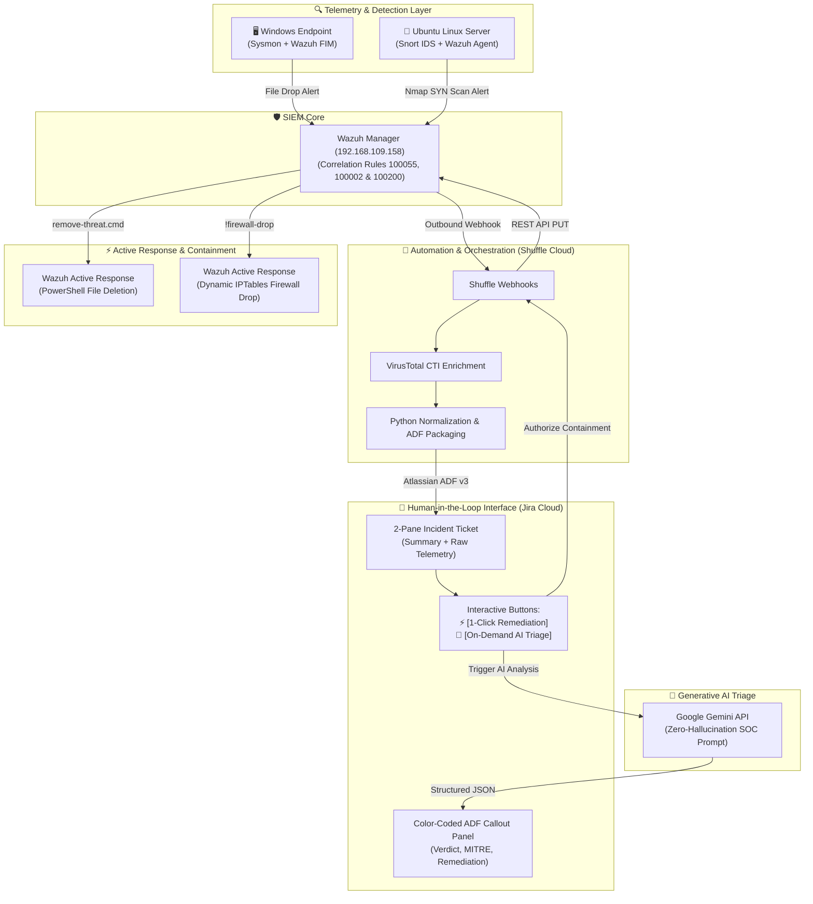

# 🛡️ Enterprise Automated SOC & AI-Powered Incident Response Platform (SOAR Lab)

---

## 📌 Executive Summary

Traditional Security Operations Centers (SOCs) face two critical challenges:
1. **Alert Fatigue:** Tier 1 analysts are overwhelmed by thousands of disconnected alerts daily.
2. **The "Blast Radius" of Unchecked Automation:** Fully autonomous response scripts (e.g., auto-quarantining critical servers or auto-blocking internal IP addresses) can cause severe production outages.

This project implements an **Enterprise-grade, Human-in-the-Loop (HitL) Security Orchestration, Automation, and Response (SOAR) ecosystem**. By interconnecting **Wazuh SIEM**, **Snort NIDS**, **Shuffle SOAR Cloud**, **Atlassian Jira Cloud**, and **Google Gemini LLM**, this lab demonstrates how modern SecOps teams can automate triage, enrich alerts with Cyber Threat Intelligence (CTI), generate structured incident tickets, and empower analysts to trigger verified remediation with 1-click authorization.

---

## 🏛️ End-to-End System Architecture

---

## 🖥️ Lab Environment & Network Schema

| Node / Component | Platform / Deployment | IP Address | Lab Role & Responsibilities |
| :--- | :--- | :---: | :--- |
| **Kali Linux** | Virtual Machine (Attacker) | `192.168.109.165` | Adversary host: Nmap stealth port scanning & threat emulation |
| **Wazuh Server** | Virtual Machine (SIEM Core) | `192.168.109.158` | Central Wazuh Manager (All-in-One): log correlation, rule engine & response dispatch |
| **Ubuntu Node** | Virtual Machine (Target / NIDS) | `192.168.109.161` | Target server: Snort 2.9 NIDS (Rule `1000005`) & Wazuh Agent `002` |
| **Windows 10** | Virtual Machine (Target / Endpoint) | `192.168.109.167` | Victim workstation: Microsoft Sysmon (Event ID 10) & Wazuh Agent `003` (Real-Time FIM) |
| **Shuffle SOAR** | Cloud SaaS (`shuffler.io`) | Cloud (SaaS) | Security Orchestration, Automation, and Response (SOAR) workflow engine |
| **Jira Cloud** | Cloud SaaS (`atlassian.net`) | Cloud (SaaS) | Incident Management (ITSM) & Human-in-the-Loop 1-Click containment interface |
| **Google Gemini & VT** | Cloud REST APIs | Cloud (API) | L3 AI incident triage copilot & VirusTotal Cyber Threat Intelligence (CTI) |

---

## 🚀 Incident Response Playbooks (Documentation Hub)

This repository adopts a modular **Hub & Spoke** documentation architecture. Click on each playbook card below to read the comprehensive technical case study, step-by-step screenshots, and evidence trails:

| Playbook & MITRE ATT&CK | Attack Vector & Telemetry | Technology Stack | Technical Case Study |
| :--- | :--- | :--- | :---: |
| **Playbook 1: OS Credential Dumping** `T1003.001` • `TA0006` | • ProcDump LSASS memory dump (Atomic Red Team) • Sysmon Event ID 10 (`GrantedAccess: 0x1fffff`) • Wazuh SIEM Rule 100200 (Level 12) • True Positive vs. False Positive Discrimination | Atomic Red Team, Sysmon, Wazuh SIEM, Shuffle SOAR, Jira Cloud, Google Gemini API | [View Case Study →](docs/playbooks/playbook_1_lsass_dump_defense.md) |
| **Playbook 2: Network Reconnaissance** `T1595.002` • `T1046` | • Stealth Nmap TCP SYN scan against internal host • Snort 2.9 NIDS detection (Rule `1:1000005:2`) • Wazuh SIEM Rule 100002 (Level 12) • Host containment verification (100% packet loss) | Snort 2.9, Wazuh SIEM, VirusTotal API, Shuffle SOAR, Jira Cloud, Google Gemini API, Linux IPTables | [View Case Study →](docs/playbooks/playbook_2_nmap_defense.md) |
| **Playbook 3: Endpoint Malware (FIM)** `T1204.002` • `T1105` | • Dropped Trojan executable in Downloads (`lesson29.exe`) • Wazuh Real-Time FIM detection (Rule 100055, Level 10) • VirusTotal threat intelligence (30/71 engines flagged) • Benign noise suppression filter (`HWiNFO64.exe`) | Wazuh Realtime FIM, VirusTotal API, Shuffle SOAR, Jira Cloud, Google Gemini API, Active Response | [View Case Study →](docs/playbooks/playbook_3_malware_containment_fim.md) |

---

## 📚 Technical Reference Guides & Engineering Artifacts

* 🔀 **[Shuffle SOAR Production Workflow Templates](playbooks/shuffle_workflows/README.md):** 5 ready-to-import JSON workflow files for Shuffle SOAR (Nmap Detection, Firewall Drop, FIM Malware, Active Response Delete, and Gemini AI Triage).
* ⚡ **[Custom Active Response Script](scripts/active_response/):** Production Windows malware containment script (`remove-threat.cmd`) invoked on-demand via SOAR 1-Click authorization.
* ⚙️ **[SIEM & Sensor Configurations](configs/):** Production detection rules for Wazuh Manager (`local_rules.xml`), Snort NIDS (`local.rules`), and Microsoft Sysmon telemetry filters (`sysmonconfig.xml`).
* 🧠 **[AI SOC Copilot Prompt Engineering](prompts/soc_analyst_l3_prompt.md):** Zero-hallucination L3 SOC Analyst system prompt and structured JSON schema for Google Gemini API integration.

---

## 👨‍💻 Author & Contact

* **Role:** SOC Analyst / Security Automation Engineer
* **Core Skills:** SIEM/SOAR Architecture, Detection Engineering, Incident Response, Python Automation, Generative AI for SecOps.
