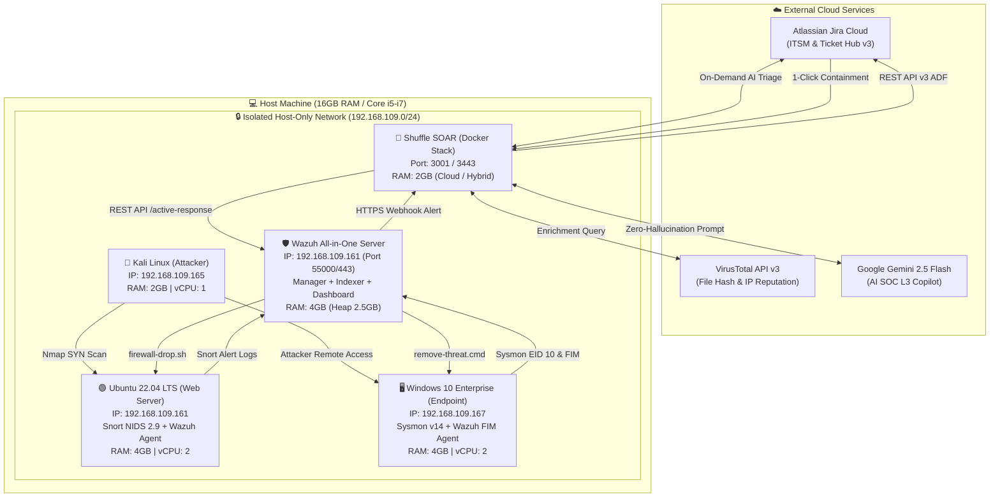

# 🌐 SOC Lab Architecture, Network Topology & Deployment Guide

Tài liệu này hướng dẫn chi tiết sơ đồ mạng (Network Topology), quy hoạch dải địa chỉ IP, bảng định mức tài nguyên tối ưu cho máy tính 16GB RAM, và quy trình cấu hình liên kết (Integration Hookup) giữa các thành phần trong hệ sinh thái SOC Automation.

---

## 🏛️ Sơ Đồ Topology Mạng Phòng Lab (Network Architecture)



---

## 📋 Bảng Phân Bổ Địa Chỉ IP & Vai Trò Thành Phần

| Node / Máy ảo | Hệ Điều Hành | Địa chỉ IP | RAM Cấp phát | Vai trò trong Lab |
| :--- | :--- | :---: | :---: | :--- |
| **Attacker VM** | Kali Linux 2024.x | `192.168.109.165` | 2.0 GB | Máy tấn công: Nmap SYN stealth scan, phân phối payload độc hại. |
| **DMZ Web Server** | Ubuntu Server 22.04 LTS | `192.168.109.161` | 4.0 GB | Mục tiêu mạng: Chạy Apache2, Snort 2.9 NIDS (`eth0`), và Wazuh Linux Agent. |
| **Endpoint VM** | Windows 10 Enterprise | `192.168.109.167` | 4.0 GB | Nạn nhân văn phòng: Cài đặt Sysmon (EID 10) và Wazuh Agent FIM Realtime. |
| **SOC SIEM Core** | Ubuntu (All-in-One) | `192.168.109.161` | 4.0 GB | Wazuh Manager v4.x, Elasticsearch/Indexer, và Wazuh Dashboard. |
| **SOAR Platform** | Shuffle SOAR | Cloud / Docker | 2.0 GB | Điều phối tự động hóa, kết nối Webhook, Python Parser, VirusTotal, Jira, Gemini. |
| **Host OS** | Windows 11 / Linux | `192.168.109.1` | 4.0 GB | Máy tính vật lý quản lý ảo hóa (VirtualBox / VMware Workstation). |

> [!NOTE]
> **Tối ưu hóa ngân sách RAM 16GB:**
> Tổng lượng RAM cấp phát cho các máy ảo là **12 GB** (2GB Kali + 4GB Ubuntu + 4GB Windows + 2GB Shuffle/Docker). Máy trạm Host giữ lại **4 GB**, đảm bảo hệ điều hành máy thật vận hành mượt mà không bị tình trạng tràn bộ nhớ (Memory Thrashing / Swap lag).

---

## ⚙️ Hướng Dẫn Tối Ưu Hóa Wazuh JVM Cho Máy 16GB RAM

Mặc định, cụm Wazuh Indexer (OpenSearch) sẽ cố gắng chiếm dụng 50% RAM hệ thống. Để ngăn chặn sự cố tràn RAM trên máy Ubuntu 4GB RAM, ta điều chỉnh dung lượng Heap size của JVM:

1. Chỉnh sửa file cấu hình JVM:
   ```bash
   sudo nano /etc/wazuh-indexer/jvm.options
   ```
2. Đặt giới hạn Heap tối thiểu và tối đa ở mức **2.5 GB**:
   ```text
   -Xms2560m
   -Xmx2560m
   ```
3. Khởi động lại dịch vụ:
   ```bash
   sudo systemctl restart wazuh-indexer wazuh-manager wazuh-dashboard
   ```

---

## 🔗 Cấu Hình Kết Nối Webhook Từ Wazuh Đến Shuffle SOAR

Trong file `/var/ossec/etc/ossec.conf` trên Wazuh Manager, thêm các khối `<integration>` để tự động đẩy cảnh báo sang Webhook của Shuffle:

```xml
<!-- Tích hợp Cảnh báo Nmap Reconnaissance sang Shuffle SOAR -->
<integration>
  <name>shuffle</name>
  <hook_url>https://shuffler.io/api/v1/hooks/webhook_669202e8-00cf-4f1d-bca6-2a005a2fec8e</hook_url>
  <rule_id>100002</rule_id>
  <alert_format>json</alert_format>
</integration>

<!-- Tích hợp Cảnh báo FIM Endpoint Malware sang Shuffle SOAR -->
<integration>
  <name>shuffle</name>
  <hook_url>https://shuffler.io/api/v1/hooks/webhook_1650f37e-0dce-4aac-90bc-ce5ff735d39f</hook_url>
  <rule_id>100055</rule_id>
  <alert_format>json</alert_format>
</integration>
```

---

## ⚡ Cấu Hình Wazuh Active Response Cho Tự Động Hóa 1-Click

Để Shuffle SOAR có thể gửi lệnh qua REST API của Wazuh Manager (`PUT /active-response`) xuống các Agent, cần khai báo các khối `<command>` tương ứng trong `ossec.conf`:

```xml
<!-- 1. Cấu hình Active Response Chặn IP trên Linux (IPTables) -->
<command>
  <name>firewall-drop</name>
  <executable>firewall-drop.sh</executable>
  <timeout_allowed>yes</timeout_allowed>
</command>

<!-- 2. Cấu hình Active Response Xóa file mã độc trên Windows -->
<command>
  <name>remove-threat0</name>
  <executable>remove-threat.cmd</executable>
  <timeout_allowed>no</timeout_allowed>
</command>
```

---

## 🛡️ Kiểm Tra Trạng Thái Vận Hành Của Lab

Sau khi khởi động toàn bộ phòng Lab, thực hiện kiểm tra nhanh các dịch vụ bằng lệnh sau:

* **Kiểm tra Wazuh Manager & Agent:**
  ```bash
  sudo /var/ossec/bin/wazuh-control status
  sudo /var/ossec/bin/agent_control -l
  ```
* **Kiểm tra luồng ghi log của Snort:**
  ```bash
  sudo tail -f /var/log/snort/snort.alert.fast
  ```
* **Kiểm tra kết nối Shuffle Webhook:**
  ```bash
  curl -X POST -H "Content-Type: application/json" -d '{"test": "ping"}' https://shuffler.io/api/v1/hooks/webhook_xxxx
  ```
