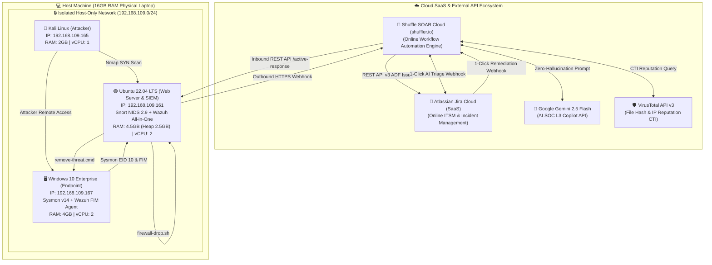

# 🌐 SOC Lab Architecture, Network Topology & Deployment Guide

Tài liệu này hướng dẫn chi tiết sơ đồ mạng (Network Topology), quy hoạch dải địa chỉ IP, bảng định mức tài nguyên tối ưu cho máy tính 16GB RAM theo mô hình **Hybrid Cloud SOAR** (kết hợp dịch vụ đám mây và máy ảo cục bộ), cùng quy trình cấu hình liên kết (Integration Hookup) giữa các thành phần trong hệ sinh thái SOC Automation.

---

## 🏛️ Sơ Đồ Topology Mạng Phòng Lab (Network Architecture)



---

## 📋 Bảng Phân Bổ Địa Chỉ IP & Định Mức Tài Nguyên (16GB RAM Optimization)

Nhờ vận hành **Shuffle SOAR** và **Jira** hoàn toàn trên nền tảng **Cloud (SaaS Online)**, máy tính Host được giải phóng toàn bộ gánh nặng tài nguyên (không phải chạy 10+ Docker containers của Shuffle cục bộ). Ngân sách RAM được phân bổ hoàn hảo cho 3 máy ảo:

| Node / Thành Phần | Nền Tảng / Hệ Điều Hành | Địa chỉ IP | RAM Cấp phát | Vai trò trong Lab |
| :--- | :--- | :---: | :---: | :--- |
| **Attacker VM** | Kali Linux 2024.x | `192.168.109.165` | 2.0 GB | Máy tấn công: Nmap SYN stealth scan, phân phối payload độc hại. |
| **DMZ & SIEM Server** | Ubuntu Server 22.04 LTS | `192.168.109.161` | 4.5 GB | Chạy Apache2, Snort 2.9 NIDS (`eth0`), và Wazuh All-in-One (Manager + Indexer + Dashboard). |
| **Endpoint VM** | Windows 10 Enterprise | `192.168.109.167` | 4.0 GB | Nạn nhân văn phòng: Cài đặt Sysmon (EID 10) và Wazuh Agent FIM Realtime. |
| **Shuffle SOAR** | Cloud SaaS (`shuffler.io`) | Cloud Hosted | **0.0 GB (Online)** | Điều phối tự động hóa, kết nối Webhook, Python Parser, VirusTotal, Jira, Gemini. |
| **Jira Cloud** | Atlassian Cloud (`*.atlassian.net`) | Cloud Hosted | **0.0 GB (Online)** | Giao diện Human-in-the-Loop, hiển thị Ticket 2-Pane, nút bấm 1-Click, và bảng ADF Comment. |
| **Google Gemini API** | Google AI Studio | Cloud API | **0.0 GB (Online)** | Mô hình ngôn ngữ lớn (LLM) hỗ trợ thẩm định sự cố mức L3. |
| **VirusTotal API** | Chronicle / Google Cloud | Cloud API | **0.0 GB (Online)** | Nền tảng Threat Intelligence kiểm tra danh tiếng IP và File Hash. |
| **Host Machine** | Windows 11 / Linux (Vật lý) | `192.168.109.1` | **5.5 GB (Dư dả)** | Hệ điều hành máy thật vận hành mượt mà, hoàn toàn không bị trễ/lag hay tràn RAM (Swap lag). |

> [!TIP]
> **Giá Trị Thực Tế Của Kiến Trúc Hybrid Cloud SOAR:**
> Trong các doanh nghiệp hiện đại, việc sử dụng Cloud SOAR (như Tines, Torq, Shuffle Cloud) và Cloud ITSM (Jira Cloud, ServiceNow) kết hợp với SIEM/Endpoint On-Premises là mô hình triển khai phổ biến nhất. Điều này vừa giúp tiết kiệm chi phí phần cứng tại chỗ, vừa đảm bảo tính sẵn sàng cao (High Availability) cho hệ thống điều phối SOC.

---

## 🌐 Cơ Chế Giao Tiếp 2 Chiều Giữa Cloud SOAR & Lab Cục Bộ

1. **Chiều Đẩy Ra (Outbound Telemetry: Wazuh On-Prem ➡️ Shuffle Cloud):**
   * Máy ảo Ubuntu Wazuh (`192.168.109.161`) sử dụng card mạng NAT / Gateway internet để gửi các bản tin cảnh báo qua HTTPS POST trực tiếp lên endpoint Webhook của Shuffle Cloud (`https://shuffler.io/api/v1/hooks/...`).
2. **Chiều Tác Động Xuống (Inbound Remediation: Shuffle Cloud ➡️ Wazuh On-Prem):**
   * Khi Analyst bấm nút 1-Click trên Jira Cloud (`☢️ CHẶN IP TẤN CÔNG` hoặc `☢️ XÓA FILE MÃ ĐỘC`), Jira gọi Webhook sang Shuffle Cloud.
   * Shuffle Cloud gửi bản tin HTTPS PUT (`/active-response`) về Wazuh Manager API (sử dụng Public IP, Port Forwarding, Reverse Proxy hoặc Cloudflare/Ngrok Tunnel) để chỉ đạo máy nạn nhân thực thi cô lập hoặc xóa file.

---

## ⚙️ Hướng Dẫn Tối Ưu Hóa Wazuh JVM Cho Máy 16GB RAM

Mặc định, cụm Wazuh Indexer (OpenSearch) sẽ cố gắng chiếm dụng 50% RAM hệ thống. Để ngăn chặn sự cố tràn RAM trên máy Ubuntu, ta điều chỉnh dung lượng Heap size của JVM ở mức 2.5 GB:

1. Chỉnh sửa file cấu hình JVM:
   ```bash
   sudo nano /etc/wazuh-indexer/jvm.options
   ```
2. Đặt giới hạn Heap tối thiểu và tối đa ở mức **2.5 GB**:
   ```text
   -Xms2560m
   -Xmx2560m
   ```
3. Khởi động lại dịch vụ:
   ```bash
   sudo systemctl restart wazuh-indexer wazuh-manager wazuh-dashboard
   ```

---

## 🔗 Cấu Hình Kết Nối Webhook Từ Wazuh Đến Shuffle Cloud

Trong file `/var/ossec/etc/ossec.conf` trên Wazuh Manager, thêm các khối `<integration>` để tự động đẩy cảnh báo lên Webhook của Shuffle Cloud:

```xml
<!-- Tích hợp Cảnh báo Nmap Reconnaissance sang Shuffle Cloud -->
<integration>
  <name>shuffle</name>
  <hook_url>https://shuffler.io/api/v1/hooks/webhook_669202e8-00cf-4f1d-bca6-2a005a2fec8e</hook_url>
  <rule_id>100002</rule_id>
  <alert_format>json</alert_format>
</integration>

<!-- Tích hợp Cảnh báo FIM Endpoint Malware sang Shuffle Cloud -->
<integration>
  <name>shuffle</name>
  <hook_url>https://shuffler.io/api/v1/hooks/webhook_1650f37e-0dce-4aac-90bc-ce5ff735d39f</hook_url>
  <rule_id>100055</rule_id>
  <alert_format>json</alert_format>
</integration>
```

---

## ⚡ Cấu Hình Wazuh Active Response Cho Tự Động Hóa 1-Click

Để Shuffle Cloud có thể điều phối phản ứng qua REST API của Wazuh Manager (`PUT /active-response`) xuống các Agent, cần khai báo các khối `<command>` tương ứng trong `ossec.conf`:

```xml
<!-- 1. Cấu hình Active Response Chặn IP trên Linux (IPTables) -->
<command>
  <name>firewall-drop</name>
  <executable>firewall-drop.sh</executable>
  <timeout_allowed>yes</timeout_allowed>
</command>

<!-- 2. Cấu hình Active Response Xóa file mã độc trên Windows -->
<command>
  <name>remove-threat0</name>
  <executable>remove-threat.cmd</executable>
  <timeout_allowed>no</timeout_allowed>
</command>
```

---

## 🛡️ Kiểm Tra Trạng Thái Vận Hành Của Lab

Sau khi khởi động toàn bộ phòng Lab, thực hiện kiểm tra nhanh các dịch vụ bằng lệnh sau:

* **Kiểm tra Wazuh Manager & Agent:**
  ```bash
  sudo /var/ossec/bin/wazuh-control status
  sudo /var/ossec/bin/agent_control -l
  ```
* **Kiểm tra luồng ghi log của Snort:**
  ```bash
  sudo tail -f /var/log/snort/snort.alert.fast
  ```
* **Kiểm tra kết nối Shuffle Cloud Webhook:**
  ```bash
  curl -X POST -H "Content-Type: application/json" -d '{"test": "ping"}' https://shuffler.io/api/v1/hooks/webhook_xxxx
  ```
