# 🛡️ Playbook 1: OS Credential Dumping Detection & AI-Assisted SOC Triage
### Case Study: High-Fidelity LSASS Defense — True Positive (ProcDump) vs. False Positive (Wazuh Syscollector) & SIEM Rule Tuning

---

## 📌 Executive Summary

Modern Security Operations Centers (SOCs) struggle with two intertwined issues: alert fatigue driven by overly broad detection rules, and the risk of catastrophic outages caused by automated responses on critical operating system processes.

This case study demonstrates an end-to-end investigation pipeline for **MITRE ATT&CK T1003.001 (OS Credential Dumping: LSASS Memory)**. It highlights how **Sysmon Event ID 10**, **Wazuh SIEM**, **Shuffle SOAR**, and **Google Gemini LLM** work together to:
1. **Detect and Triage a Real Threat (True Positive - Ticket SA-76):** An adversary executing Sysinternals ProcDump to dump LSASS memory with unrestricted rights (`0x1fffff`), triggering a critical incident and immediate containment guidance.
2. **Discriminate Benign Administrative Activity (False Positive - Ticket SA-77):** Routine endpoint inventory collection by Wazuh Agent's own `syscollector.dll` reading LSASS with restricted rights (`0x1410`), correctly classified as benign by Gemini.
3. **Drive Continuous Detection Engineering:** Fine-tuning SIEM rules (`Rule 100200`) to whitelist authorized security agents and eliminate false positive noise permanently.

---

## 🗺️ MITRE ATT&CK Mapping

| Tactical Phase | Matrix ID | Technique Name | Detection / Telemetry Source |
| :--- | :--- | :--- | :--- |
| **Credential Access** | **T1003.001** | OS Credential Dumping: LSASS Memory | Sysmon Event ID 10 (Target: `lsass.exe`, Access: `0x1fffff`) |
| **Defense Evasion** | **T1036** / **T1055** | Masquerading / Living off the Land (LOLBIN) | Microsoft-signed Sysinternals `procdump64.exe` |
| **Privilege Escalation** | **T1055** | Process Injection / Memory Access | Wazuh Rule ID `100200` (Level 12) |

---

## ⚖️ Comparative Telemetry: True Positive vs. False Positive

| Attribute | Case A: True Positive (Attack) | Case B: False Positive (Benign) |
| :--- | :--- | :--- |
| **Jira Ticket** | **SA-76** | **SA-77** |
| **Source Image** | `C:\AtomicRedTeam\ExternalPayloads\procdump64.exe` | `C:\Program Files (x86)\ossec-agent\wazuh-agent.exe` |
| **Target Image** | `C:\Windows\system32\lsass.exe` | `C:\Windows\system32\lsass.exe` |
| **Granted Access** | **`0x1fffff` (`PROCESS_ALL_ACCESS`)** | **`0x1410` (`PROCESS_QUERY_LIMITED_INFORMATION | PROCESS_VM_READ`)** |
| **User Account** | `DESKTOP-LC5KHD6\SONY` (Interactive User) | `NT AUTHORITY\SYSTEM` (System Service) |
| **Call Stack Trace** | `ntdll.dll` -> `KERNELBASE.dll` | `sysinfo.dll` -> `syscollector.dll` -> `wow64.dll` |
| **Gemini Verdict** | 🛑 **`[TRUE_POSITIVE | Mức độ: KHẨN CẤP]`** (Red Panel) | ✅ **`[FALSE_POSITIVE | Mức độ: THAP]`** (Green Panel) |
| **Remediation Action**| Network host isolation, memory acquisition, credential reset | Whitelist in SIEM correlation rule, close ticket |

---

## 🏛️ End-to-End Incident Architecture

```mermaid
sequenceDiagram
    autonumber
    actor RedTeam as 🥷 Red Team / Threat Actor
    participant Victim as 🖥️ Windows 10 (Sysmon + Wazuh Agent)
    participant Wazuh as 🛡️ Wazuh SIEM Manager
    participant Shuffle as 🔀 Shuffle SOAR
    actor Analyst as 👨‍💼 SOC Analyst (Jira Cloud)
    participant Gemini as 🧠 Google Gemini AI

    rect rgb(30, 40, 60)
    Note over RedTeam,Wazuh: [PHASE 1: ATTACK SIMULATION & TELEMETRY INGESTION]
    RedTeam->>Victim: 1. Execute Atomic Red Team T1003.001-1 (ProcDump)
    Victim->>Victim: 2. procdump64.exe writes 56MB lsass_dump.dmp
    Victim->>Victim: 3. Sysmon logs Event ID 10 (GrantedAccess: 0x1fffff)
    Victim->>Wazuh: 4. Agent streams event log to Wazuh Manager
    Wazuh->>Wazuh: 5. Correlate Rule 100200 (Level 12 - Critical)
    end

    rect rgb(40, 50, 40)
    Note over Wazuh,Analyst: [PHASE 2: SOAR AUTOMATION & INCIDENT TICKETING]
    Wazuh->>Shuffle: 6. Dispatch JSON webhook to Shuffle SOAR
    Shuffle->>Shuffle: 7. Parse GUIDs, PIDs, CallTrace & package ADF v3 payload
    Shuffle->>Analyst: 8. Auto-create Jira Incident Ticket SA-76 (2-Pane ADF)
    end

    rect rgb(50, 30, 30)
    Note over Analyst,Gemini: [PHASE 3: ON-DEMAND AI SOC TRIAGE & INVESTIGATION]
    Analyst->>Analyst: 9. Review Ticket SA-76 & click ⚡ Automation -> AI_support
    Analyst->>Shuffle: 10. Secondary webhook forwards ticket context
    Shuffle->>Gemini: 11. Dispatch raw telemetry into Zero-Hallucination Prompt
    Gemini->>Shuffle: 12. Return TRUE_POSITIVE verdict & 6-step remediation plan
    Shuffle->>Analyst: 13. Render color-coded ADF Callout Panel in Jira comments
    end
```

---

## 🛡️ Architectural Trade-off: Why No Automated Kill on LSASS?

> [!IMPORTANT]
> **Windows Internals & Operational Reliability Consideration:**
> `lsass.exe` (*Local Security Authority Subsystem Service*) is a core Windows operating system component responsible for authenticating users, managing security tokens, and enforcing domain policies.
> 
> If an automated SOAR or EDR script attempts a reckless termination (`taskkill /f /im lsass.exe`) or interferes unsafely with the process address space, Windows immediately triggers a critical system halt (**BugCheck / Blue Screen of Death**) or initiates a forced emergency reboot (*"A critical system process failed with status code c0000005. The system must restart in 60 seconds"*).
> 
> Therefore, mature enterprise SOC doctrine mandates that for **LSASS Process Access incidents**, the automated response is deliberately scoped to:
> 1. **High-Fidelity Telemetry Capture:** Catching the anomalous `0x1fffff` (`PROCESS_ALL_ACCESS`) mask via Sysmon.
> 2. **Rapid Incident Contextualization:** Generating enriched 2-Pane tickets via SOAR.
> 3. **AI Copilot Acceleration:** Validating malicious intent vs. legitimate administration tools in under 3 seconds.
> 4. **Controlled Containment:** Network isolation of the host to sever lateral movement, taking memory snapshots for forensic evidence, and systematically revoking compromised account credentials.

---

## 📸 Step-by-Step Visual Incident Walkthrough

### Part A: True Positive — Adversary Credential Dumping (Ticket SA-76)

#### Step 1: Baseline Environment State (Before Attack)
Prior to launching the credential dumping attack, the SOC incident queue is clean and idle:

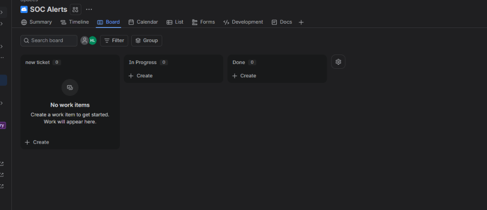

---

#### Step 2: Adversary Emulation via Atomic Red Team
To validate our SOC detection pipeline against real-world threat actors, we leverage the **Atomic Red Team** testing framework:

* **T1003.001 Technique Catalog:**
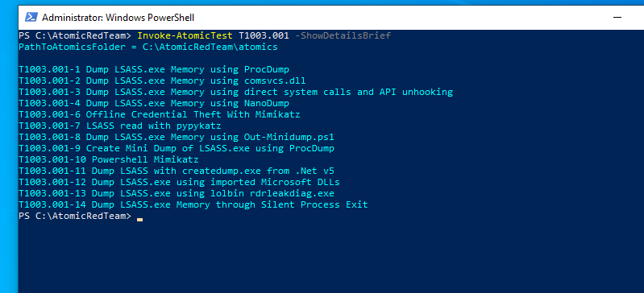

* **Atomic Test 1 Configuration (ProcDump LSASS):**
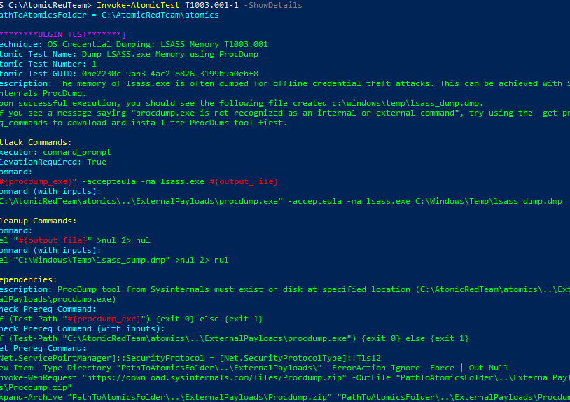
*(Execution command: `"procdump.exe" -accepteula -ma lsass.exe C:\Windows\Temp\lsass_dump.dmp`).*

---

#### Step 3: Attack Execution — Extracting LSASS Memory
The adversary executes the attack on the Windows 10 workstation (`DESKTOP-LC5KHD6`). ProcDump attaches to the LSASS process and dumps **56 MB of process memory in just 0.9 seconds**:

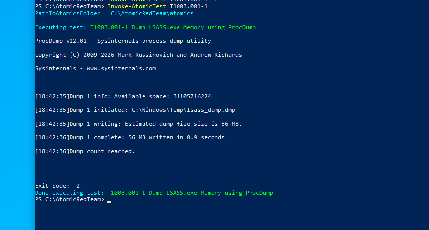

---

#### Step 4: SIEM Detection & Telemetry Ingestion
Sysmon captures the process access event, which is transmitted to the Wazuh Manager, firing **Rule 100200 (Level 12 - Critical Alert)**:

* **Wazuh SIEM Dashboard Alert Spike (17 Level 12+ alerts):**
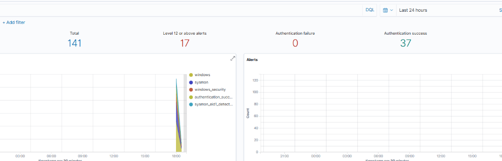

* **Wazuh Event Table & Deep Telemetry:**
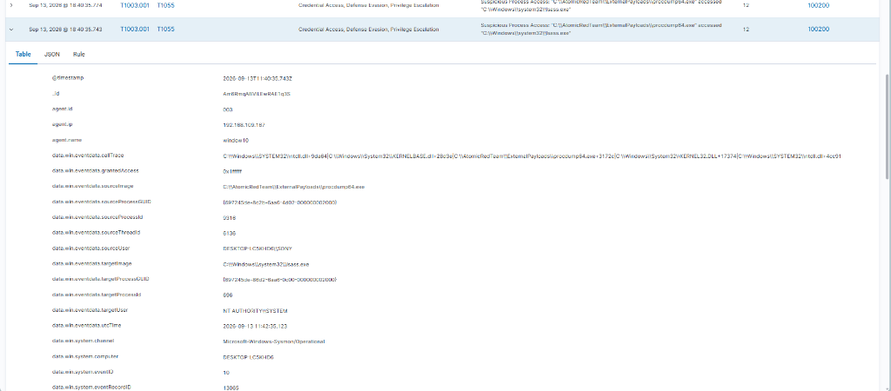
*(Telemetry reveals: Source `procdump64.exe`, Target `lsass.exe`, `Sysmon Event ID: 10`, and `grantedAccess: 0x1fffff`).*

---

#### Step 5: Automated 2-Pane Jira Ticket Generation (Shuffle SOAR)
Shuffle SOAR parses the incoming alert and automatically opens Incident Ticket **Jira `SA-76`**:

* **Pane 1 (Executive Summary):**
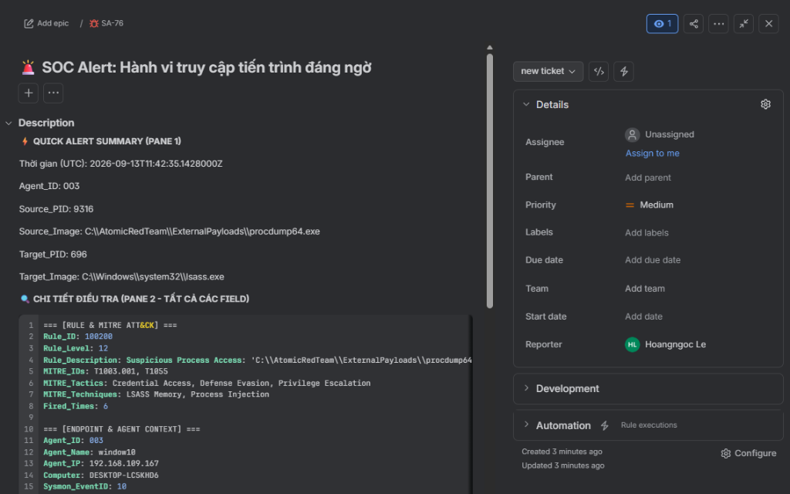
*(Pinpoints Source PID `9316` targeting Target PID `696` of `lsass.exe`).*

* **Pane 2 (Raw Telemetry Code Block):**
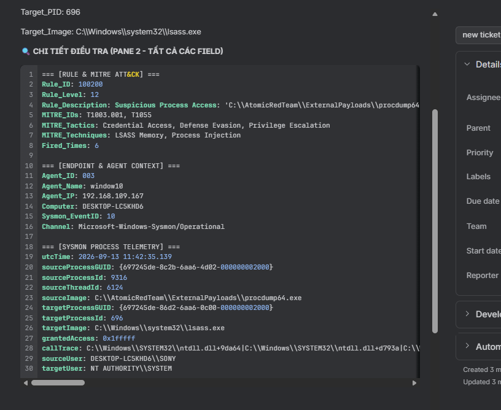
*(Full Sysmon Event 10 dump including Process GUIDs, User `DESKTOP-LC5KHD6\SONY`, and the `ntdll.dll` call stack).*

---

#### Step 6: On-Demand AI Incident Triage (Google Gemini Integration)
The SOC Analyst opens ticket SA-76, clicks **⚡ Automation**, and selects **`AI_support`**:

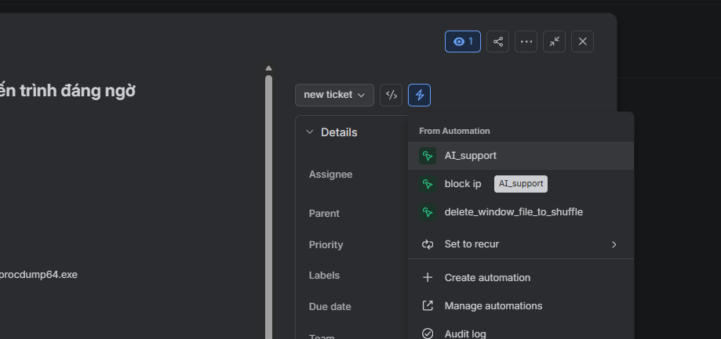

---

#### Step 7: Expert AI Triage Verdict & Remediation Guidance (Ticket SA-76)
Within 2.5 seconds, Google Gemini returns a structured, color-coded **ADF Callout Panel (RED)** directly into the Jira ticket comments:

* **Part 1: Triage Verdict & Attacker Intent Analysis:**
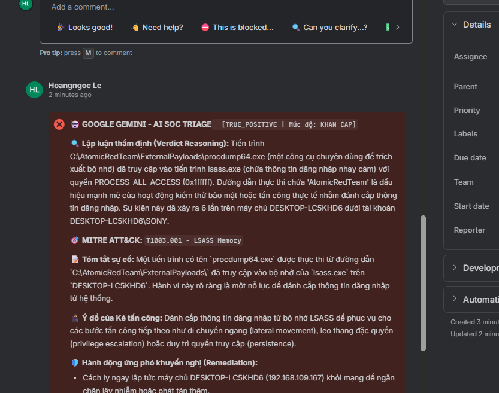
  * **Verdict:** `[TRUE_POSITIVE | Mức độ: KHẨN CẤP]`
  * **Technical Reasoning:** Verifies `procdump64.exe` accessed `lsass.exe` with `PROCESS_ALL_ACCESS (0x1fffff)`. Path `AtomicRedTeam` confirms active credential harvesting behavior.
  * **Adversary Intent:** Stealing credentials to facilitate Lateral Movement, Privilege Escalation, or Persistence.

* **Part 2: 6-Step Incident Response Playbook:**
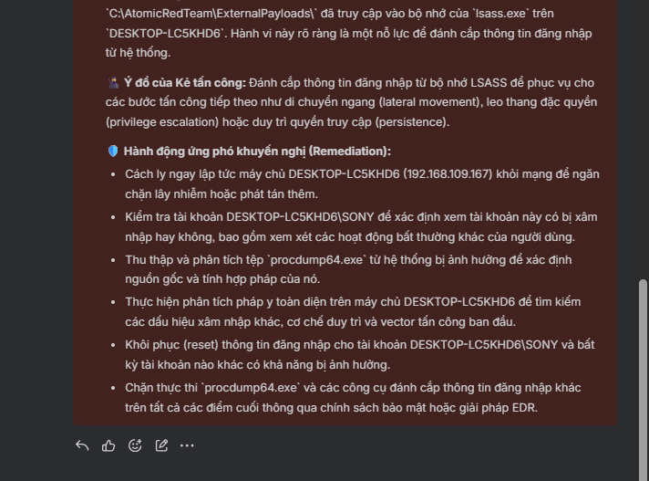
  1. *Immediately isolate workstation `DESKTOP-LC5KHD6 (192.168.109.167)` from the network.*
  2. *Audit the `DESKTOP-LC5KHD6\SONY` user account for anomalous concurrent sessions.*
  3. *Acquire `procdump64.exe` and `lsass_dump.dmp` for offline malware analysis.*
  4. *Perform digital memory forensics to verify if tokens or NTLM hashes were exfiltrated.*
  5. *Force a credential reset on all accounts potentially stored in LSASS memory.*
  6. *Implement EDR block rules and AppLocker policies to prevent unauthorized memory dump utilities.*

---

### Part B: False Positive Discrimination & Detection Engineering (Ticket SA-77)

In an enterprise environment, legitimate administrative agents (e.g., EDRs, inventory scanners, SIEM agents) frequently inspect running processes. Broad detection rules often flag these as potential credential dumps, creating massive alert fatigue.

#### Step 8: Administrative Telemetry Ingestion (Ticket SA-77)
Wazuh Agent's own system inventory module (`syscollector.dll`) performs scheduled hardware and process discovery on `DESKTOP-LC5KHD6`. Rule 100200 fires on the event, generating Ticket **Jira `SA-77`**:

* **Pane 1 (Summary of Routine Inspection):**
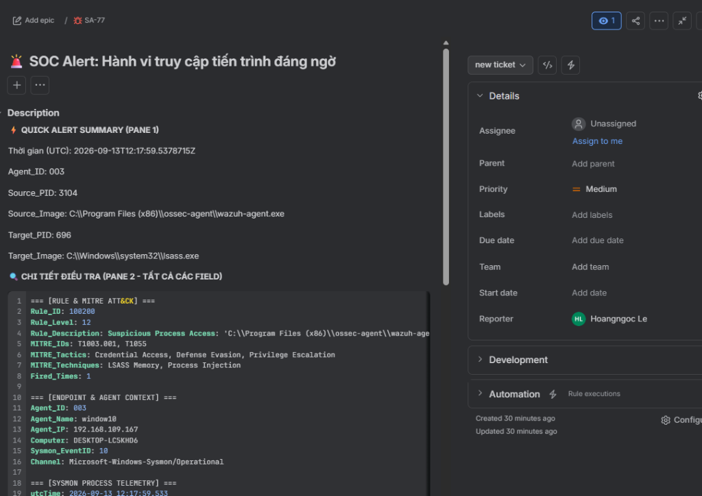
*(Source: `C:\Program Files (x86)\ossec-agent\wazuh-agent.exe`, Target: `lsass.exe`, Target_PID: 696).*

* **Pane 2 (Telemetry Clues — GrantedAccess 0x1410):**
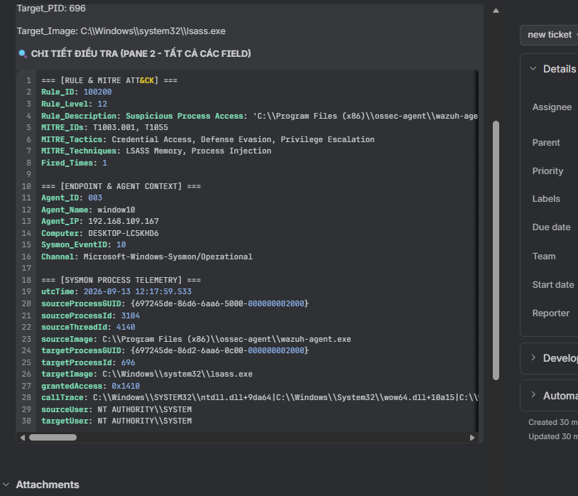
*(Deep inspection reveals: `grantedAccess: 0x1410`, user `NT AUTHORITY\SYSTEM`, and call stack from `sysinfo.dll` / `syscollector.dll`).*

---

#### Step 9: On-Demand AI False Positive Validation (Ticket SA-77)
The analyst triggers **`AI_support`** on Ticket SA-77. Google Gemini parses the telemetry, cross-references the restricted access mask (`0x1410`) with the legitimate binary path, and returns a **GREEN Callout Panel**:

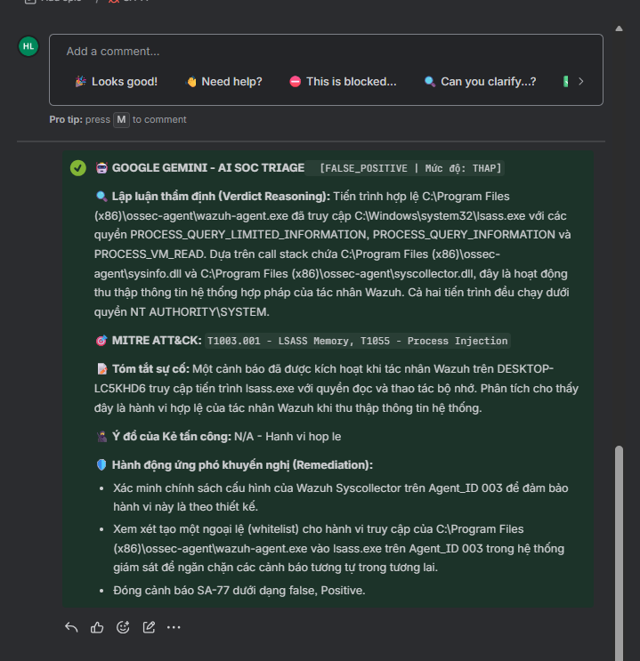

* **Verdict:** ✅ `[FALSE_POSITIVE | Mức độ: THAP]`
* **Technical Reasoning:** Confirms `wazuh-agent.exe` only requested query and read privileges (`PROCESS_QUERY_LIMITED_INFORMATION | PROCESS_VM_READ`). The call stack explicitly references `sysinfo.dll` and `syscollector.dll`.
* **Attacker Intent:** `N/A - Hanh vi hop le` (Benign administrative behavior).
* **Remediation Recommendation:**
  1. Verify Wazuh Syscollector configuration policy.
  2. Implement an exception (whitelist) for `wazuh-agent.exe` in SIEM detection rules.
  3. Close Ticket SA-77 as **False Positive**.

---

## ⚙️ Configuration Files & Code References

* **Wazuh Correlation Rule:** [`configs/wazuh/local_rules.xml`](../../configs/wazuh/local_rules.xml) (`Rule ID: 100200`)
* **Sysmon ProcessAccess Filter:** [`configs/sysmon/sysmonconfig.xml`](../../configs/sysmon/sysmonconfig.xml)
* **AI SOC Prompt System:** [`prompts/soc_analyst_l3_prompt.md`](../../prompts/soc_analyst_l3_prompt.md)

---

[⬅️ Back to Main Repository Overview](../../README.md)
