# 🌐 Playbook 2: Network Reconnaissance & Dynamic Firewalling
### Case Study: Thwarting Stealth Nmap Reconnaissance via Snort NIDS, Wazuh SIEM, VirusTotal CTI & Dynamic IPTables Containment

---

## 📌 Executive Summary

* **Target System:** Production Web Server (`192.168.109.161` - Ubuntu 22.04 LTS), running SSH (`22/tcp`) and HTTP (`80/tcp`).
* **Attacker Profile:** Threat Actor (`192.168.109.165` - Kali Linux) initiating active network reconnaissance.
* **Attack Technique:** Stealth SYN Port Scan (`nmap -sS -p 1-1000 --min-rate 1000`).
* **Detection Mechanism:** Custom Snort 2.9 NIDS Rule (`SID: 1000005`) correlated by Wazuh Manager (`Rule 100002`, Level 12).
* **Response Strategy:** Human-in-the-Loop 2-Phase SOAR execution via Shuffle SOAR and Jira Cloud, enforcing dynamic host-based firewall containment (`iptables -I INPUT -s <IP> -j DROP`).
* **Containment Verification:** 100% packet drop (`60 packets transmitted, 0 received, 100% packet loss`).

---

## 🗺️ MITRE ATT&CK Mapping

| Tactical Phase | Matrix ID | Technique Name | Detection / Telemetry Source |
| :--- | :--- | :--- | :--- |
| **Reconnaissance** | **TA0043** | Reconnaissance | Network traffic analysis, IDS alerts |
| **Discovery** | **T1046** | Network Service Discovery | Snort NIDS (`local.rules`, TCP SYN flags) |
| **Active Scanning** | **T1595.002** | Vulnerability / Port Scanning | Snort thresholding & Wazuh SIEM correlation |

---

## 🏛️ Architecture & Incident Flow

```mermaid
sequenceDiagram
    autonumber
    actor Kali as 🥷 Attacker (Kali: 192.168.109.165)
    participant Snort as 👁️ Snort NIDS (Ubuntu: 192.168.109.161)
    participant Wazuh as 🛡️ Wazuh SIEM Manager (192.168.109.158)
    participant Shuffle as 🔀 Shuffle SOAR
    participant VT as 🌐 VirusTotal CTI
    actor Analyst as 👨‍💼 SOC Analyst (Jira)
    participant IPTables as 🧱 Linux IPTables Firewall

    rect rgb(30, 40, 60)
    Note over Kali,Analyst: [PHASE 1: DETECTION, THREAT INTEL & TICKETING]
    Kali->>Snort: 1. Nmap Stealth SYN Scan (Ports 1-1000)
    Snort->>Snort: 2. Match Rule 1000005 (TCP Flags: SYN only)
    Snort->>Wazuh: 3. Agent streams log to Manager
    Wazuh->>Wazuh: 4. Correlate Rule 100002 (Level 12 - Critical)
    Wazuh->>Shuffle: 5. Dispatch JSON Webhook
    Shuffle->>VT: 6. Query IP Reputation via VirusTotal API
    Shuffle->>Shuffle: 7. Python normalizes 2-Pane ADF payload
    Shuffle->>Analyst: 8. Create Jira Incident Ticket SA-72
    end

    rect rgb(50, 30, 30)
    Note over Analyst,IPTables: [PHASE 2: HUMAN-IN-THE-LOOP CONTAINMENT]
    Analyst->>Analyst: 9. Investigate Ticket & Click ⚡ [block ip]
    Analyst->>Shuffle: 10. Secondary Webhook fires
    Shuffle->>Wazuh: 11. REST API PUT /active-response (!firewall-drop)
    Wazuh->>IPTables: 12. Insert: iptables -I INPUT -s 192.168.109.165 -j DROP
    IPTables-->>Kali: 13. Attacker traffic severed (100% packet loss)
    end
```

---

## 📸 Step-by-Step Visual Incident Walkthrough

### Step 1: Baseline Environment State (Before Attack)
Before the reconnaissance attack begins, all monitoring environments are clear and idle:

* **Wazuh SIEM Dashboard (No active security alerts):**
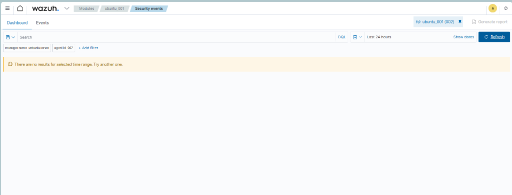

* **Jira Cloud SOC Board (Initial Kanban state):**
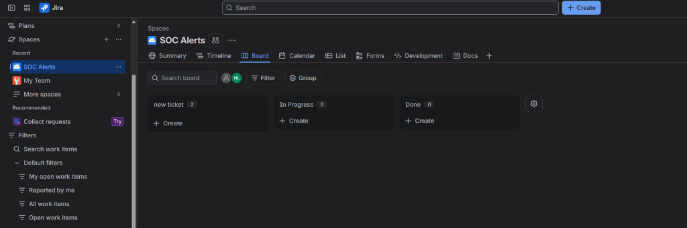

* **Baseline Network Connectivity (Kali to Web Server):**
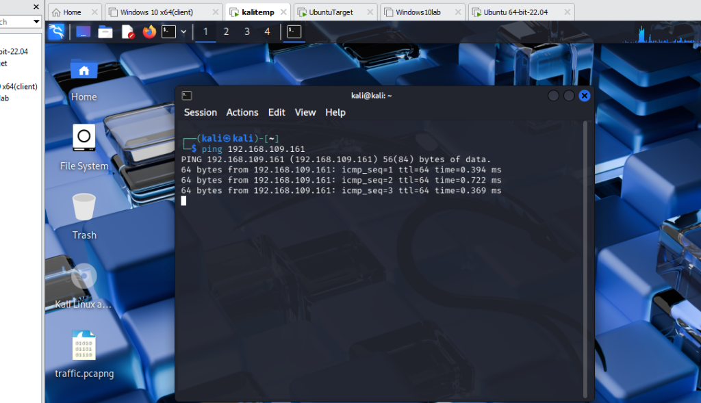
*(Kali sends ICMP ping packets to 192.168.109.161 with 0% packet loss, confirming live connectivity).*

---

### Step 2: The Attack - High-Speed Nmap SYN Scanning
The threat actor initiates an aggressive stealth scan against the first 1000 TCP ports:
```bash
nmap -sS -p 1-1000 --min-rate 1000 192.168.109.161
```
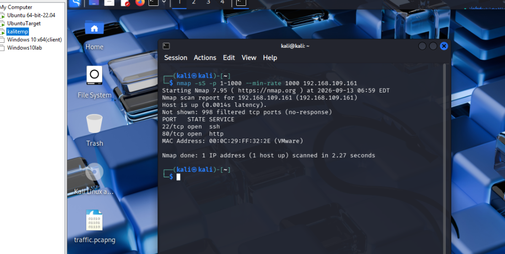
*(Result: Completed scan in 2.27 seconds, identifying open ports `22/tcp` (SSH) and `80/tcp` (HTTP)).*

---

### Step 3: Detection & SIEM Event Correlation
Snort captures the rapid TCP SYN packets matching `flags:S` with `threshold: count 100, seconds 5`. 
Wazuh Agent reads `/var/log/snort/snort.alert.fast` and forwards the event to Wazuh Manager, triggering **Critical Severity Level 12**:

* **Wazuh SIEM Security Event Spike:**
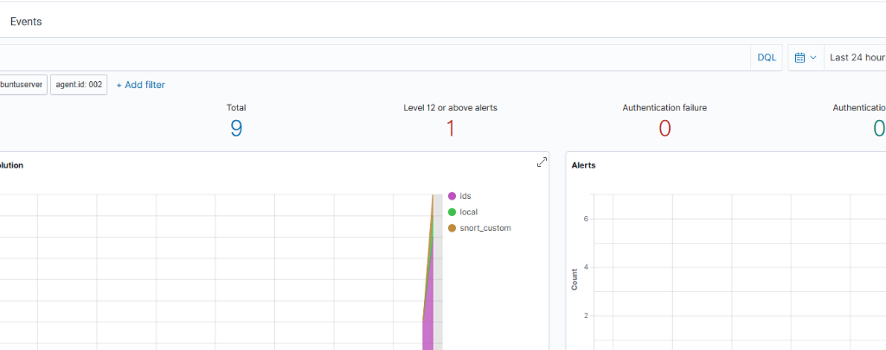

* **Wazuh Log Details & Rule Matching:**
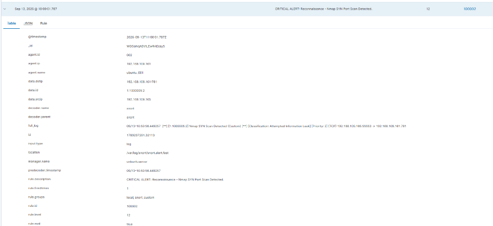
*(Telemetry confirms: Source IP `192.168.109.165`, Target `192.168.109.161:781`, Decoder `snort`, Rule `100002`).*

---

### Step 4: Automated 2-Pane Jira Ticket Generation (Shuffle SOAR)
Wazuh Manager dispatches an alert payload to Shuffle SOAR. Shuffle queries VirusTotal and formats the incident into an **Atlassian Document Format (ADF) 2-Pane layout**:

* **Pane 1 (Executive Summary & Action Banner):**
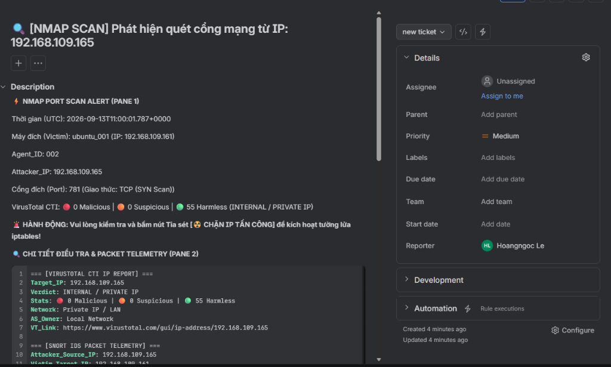
*(Provides immediate operational context: Attacker IP, Target host, Port, VirusTotal internal IP badge, and 1-click action instructions).*

* **Pane 2 (Raw Technical Telemetry Dump):**
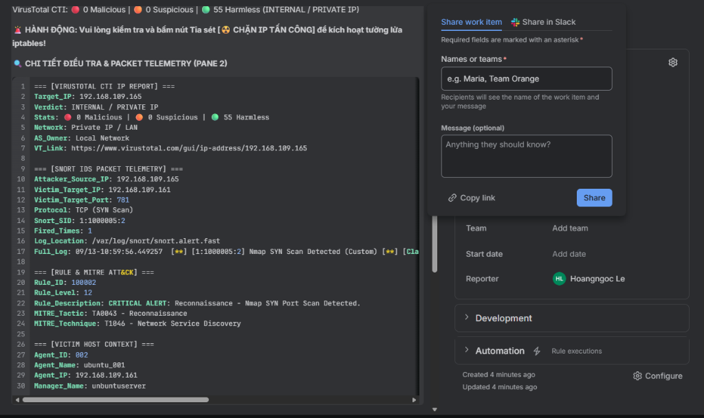
*(Embedded `{code:yaml}` block preserving full Snort SID, Wazuh rule metadata, and victim host context for deep forensic analysis).*

---

### Step 5: On-Demand AI Incident Triage (Google Gemini Integration)
The analyst requests an AI second opinion by clicking **🤖 Hỏi AI SOC**. Google Gemini analyzes raw telemetry under an 8-rule anti-hallucination framework and returns a color-coded Callout Panel in under 3 seconds:

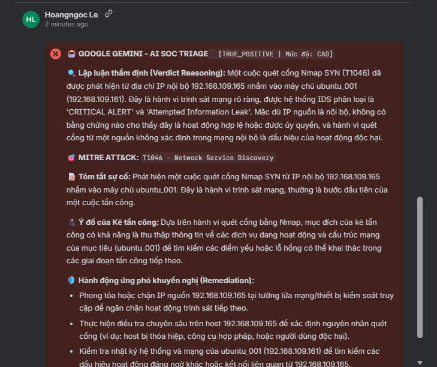
* **Verdict:** `TRUE_POSITIVE` | **Severity:** `CAO` (High)
* **Technical Reasoning:** Confirms abnormal TCP SYN behavior targeting non-standard port 781 without completing handshake.
* **MITRE ATT&CK:** `T1046 - Network Service Discovery`.
* **Remediation Plan:** Immediate host-level firewall isolation.

---

### Step 6: Human-in-the-Loop Containment Authorization
Having verified the malicious nature of the scan, the SOC Analyst clicks **⚡ Automation ➡️ `block ip`**:

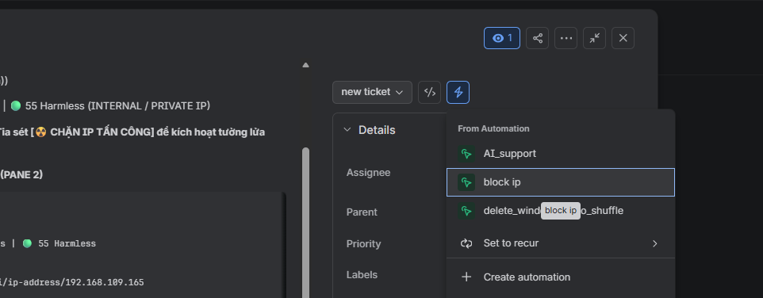

---

### Step 7: Containment Verification (100% Packet Loss)
Upon receiving the authorization webhook, Shuffle calls the Wazuh REST API with the native built-in command `!firewall-drop`, dynamically executing the host containment script (`/var/ossec/active-response/bin/firewall-drop`) to inject an iptables drop rule on the Ubuntu web server.

From the attacker machine (Kali), all network communications are immediately cut off:
```text
--- 192.168.109.161 ping statistics ---
60 packets transmitted, 0 received, 100% packet loss, time 60413ms
```
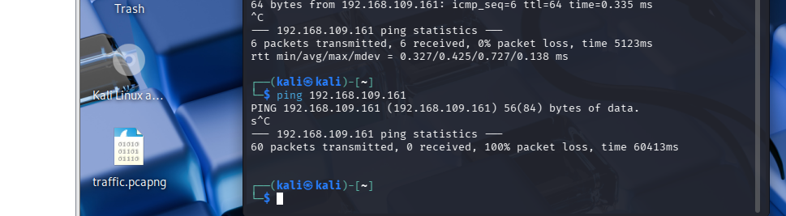
*(Comparing upper pane (before block: 0% loss) with lower pane (after block: 100% packet loss)).*

---

## ⚙️ Configuration Files & Code References

* **Snort NIDS Rule:** [`configs/snort/local.rules`](../../configs/snort/local.rules)
* **Wazuh Correlation Rule:** [`configs/wazuh/local_rules.xml`](../../configs/wazuh/local_rules.xml)
* **Wazuh Integration Hook:** [`configs/wazuh/ossec_integration.xml`](../../configs/wazuh/ossec_integration.xml)
* **Wazuh Agent Snort Ingestion:** [`configs/wazuh/ossec_agent_inputs.xml`](../../configs/wazuh/ossec_agent_inputs.xml)
* **AI SOC Prompt System:** [`prompts/soc_analyst_l3_prompt.md`](../../prompts/soc_analyst_l3_prompt.md)

---

[⬅️ Back to Main Repository Overview](../../README.md)
