# 🛡️ Playbook 3: Endpoint Malware Containment & File Integrity Monitoring (FIM)
### Case Study: Real-Time Trojan Drop Detection via Wazuh FIM, VirusTotal CTI Enrichment, Google Gemini AI Triage & SOAR Condition-Based Noise Suppression

---

## 📌 Executive Summary

* **Target System:** Windows 10 Workstation (`DESKTOP-LC5KHD6` - `192.168.109.167`), protected by Wazuh Agent `003` with Real-Time File Integrity Monitoring (FIM) enabled.
* **Attack Scenario:** Phishing / Malicious File Drop — User extracts an archive (`lesson29.rar`) delivering an executable payload (`lesson29.exe`) into `C:\Users\SONY\Downloads`.
* **File Telemetry & Cryptographic Hashes:**
  * **File Size:** 162,698 bytes
  * **MD5:** `cb9d65d9a2b8a164514a82f45fc5c7dd`
  * **SHA1:** `7e38c53845a198c47c351fc8b39a765137b06609`
  * **SHA256:** `3d63144c61592018e8468538cc491e99c78c6d525054f768db0c61f2b6495b89`
* **Threat Intelligence (VirusTotal API):**
  * **30 out of 71 Security Engines** flagged the hash as malicious (`30 Malicious | 0 Suspicious | 41 Undetected`).
  * **Threat Classification:** `trojan.shellcode/dump` (Trojan delivering shellcode payload).
* **Detection Engine:** Wazuh Real-Time FIM Rule **100055** (`syscheck_new_entry`).
* **SOAR Noise Gatekeeper:** Shuffle SOAR Condition Node (`stats.malicious > 0`) automatically filters out benign utilities (`HWiNFO64.exe`), eliminating alert fatigue at the orchestration layer.
* **Generative AI Copilot:** Google Gemini analyzes CTI and file context, confirms `TRUE_POSITIVE (HIGH)`, and recommends immediate host-level file deletion.
* **Remediation Action:** Analyst authorizes 1-click containment via Jira Automation (`delete_window_file_to_shuffle`), triggering Wazuh Active Response (`remove-threat.cmd`) to permanently purge the file.

---

## 🗺️ MITRE ATT&CK Mapping

| Tactical Phase | Matrix ID | Technique Name | Detection / Telemetry Source |
| :--- | :--- | :--- | :--- |
| **Execution** | **T1204.002** | User Execution: Malicious File | Wazuh Real-Time Syscheck (`syscheck_new_entry`) |
| **Command and Control** | **T1105** | Ingress Tool Transfer | VirusTotal CTI hash lookup (`trojan.shellcode/dump`) |
| **Execution** | **T1059** | Command and Scripting Interpreter | Wazuh Active Response (`remove-threat.cmd`) execution |

---

## 🏛️ Dual-Path Incident Architecture & SOAR Gatekeeper

```mermaid
sequenceDiagram
    autonumber
    actor RedTeam as 🥷 Threat Actor / User
    participant Victim as 🖥️ Windows 10 (Agent 003)
    participant Wazuh as 🛡️ Wazuh SIEM Manager
    participant Shuffle as 🔀 Shuffle SOAR
    participant VT as 🌐 VirusTotal API v3
    actor Analyst as 👨‍💼 SOC Analyst (Jira Cloud)
    participant Gemini as 🧠 Google Gemini API

    rect rgb(30, 40, 60)
    Note over RedTeam,Analyst: [PHASE 1: REAL-TIME FIM DETECTION & CTI GATEKEEPER]
    RedTeam->>Victim: 1. Extract Trojan payload to Downloads (lesson29.exe)
    Victim->>Victim: 2. Real-time FIM catches file creation (Rule 100055)
    Victim->>Wazuh: 3. Windows Agent streams FIM alert to Manager
    Wazuh->>Shuffle: 4. Dispatch JSON webhook with SHA256 hash
    Shuffle->>VT: 5. Query file reputation via VirusTotal API v3
    VT-->>Shuffle: 6. Return threat score (30/71 engines malicious)
    Shuffle->>Shuffle: 7. Gatekeeper Condition check (malicious > 0: PASS)
    Shuffle->>Analyst: 8. Auto-create Jira Incident Ticket SA-79 (2-Pane ADF)
    end

    rect rgb(50, 30, 30)
    Note over Analyst,Victim: [PHASE 2: AI TRIAGE & HUMAN-IN-THE-LOOP CONTAINMENT]
    Analyst->>Analyst: 9. Review Ticket SA-79 & click 🤖 Ask AI SOC
    Shuffle->>Gemini: 10. Dispatch raw telemetry into L3 SOC prompt
    Gemini-->>Analyst: 11. Return TRUE_POSITIVE (HIGH) verdict & callout panel
    Analyst->>Analyst: 12. Click ⚡ delete_window_file_to_shuffle
    Analyst->>Shuffle: 13. Secondary webhook triggers containment workflow
    Shuffle->>Wazuh: 14. REST API PUT /active-response (remove-threat0)
    Wazuh->>Victim: 15. Execute remove-threat.cmd on endpoint
    Victim->>Victim: 16. Trojan executable permanently eradicated
    end

    rect rgb(40, 50, 40)
    Note over RedTeam,Analyst: [PHASE 3: BENIGN SUPPRESSION (NOISE FILTERING)]
    RedTeam->>Victim: 17. Extract benign utility (HWiNFO64.exe)
    Victim->>Wazuh: 18. FIM catches file addition & forwards to Shuffle
    Shuffle->>VT: 19. VT reports 0 malicious engines
    Shuffle--xAnalyst: 20. Condition FALSE: Execution halted (Zero ticket spam)
    end
```

---

## 📸 Step-by-Step Visual Incident Walkthrough

### Part A: Verified Threat Containment & 1-Click Remediation (Ticket SA-79)

#### Step 1: Baseline State & Malware Extraction
Prior to infection, the SOC incident queue is clear. The user extracts the compressed archive containing the payload:

* **Jira SOC Alerts Baseline:**
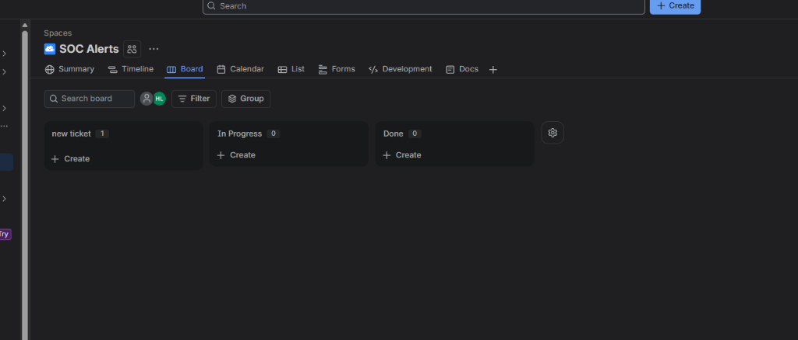

* **Opening the Archive (`lesson29.rar` containing `lesson29.exe`):**
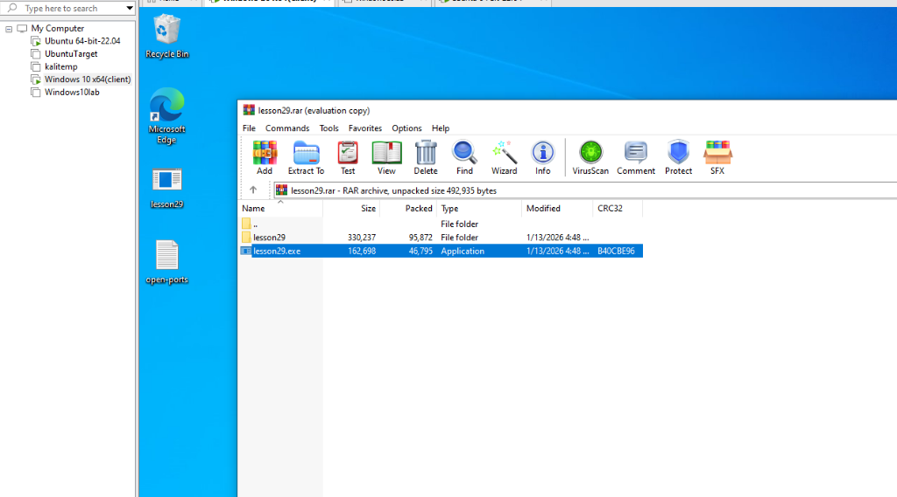

* **Extracting Payload to User Downloads:**
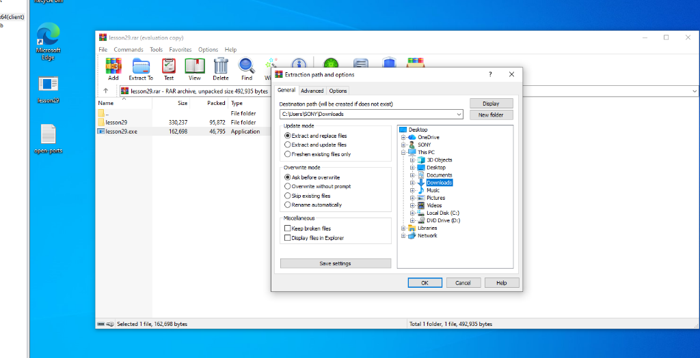

* **Malicious Executable Dropped on Disk:**
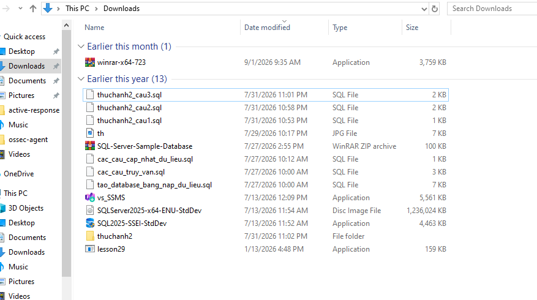

---

#### Step 2: Wazuh Real-Time FIM Detection
Wazuh's real-time syscheck engine detects the filesystem modification instantly, firing **Rule 100055**:

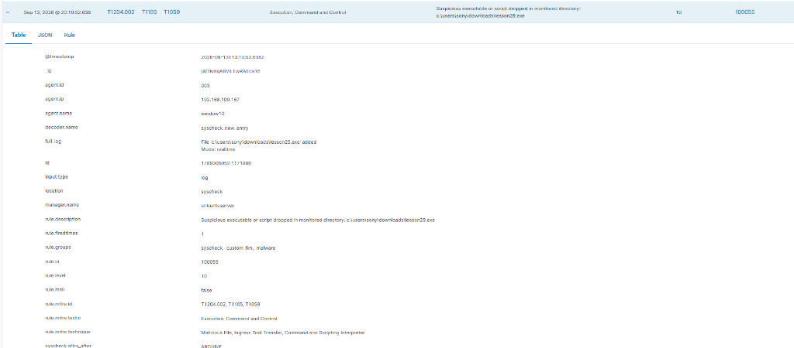
*(Telemetry: Decoder `syscheck_new_entry`, Log `File 'c:\users\sony\downloads\lesson29.exe' added Mode: realtime`).*

---

#### Step 3: Automated CTI Enrichment & Jira Ticket Creation (Ticket SA-79)
Shuffle SOAR queries VirusTotal. Because `malicious = 30 > 0`, the SOAR condition evaluates to TRUE and renders Ticket **Jira `SA-79`**:

* **Pane 1 (Executive Threat Summary & CTI Badge):**
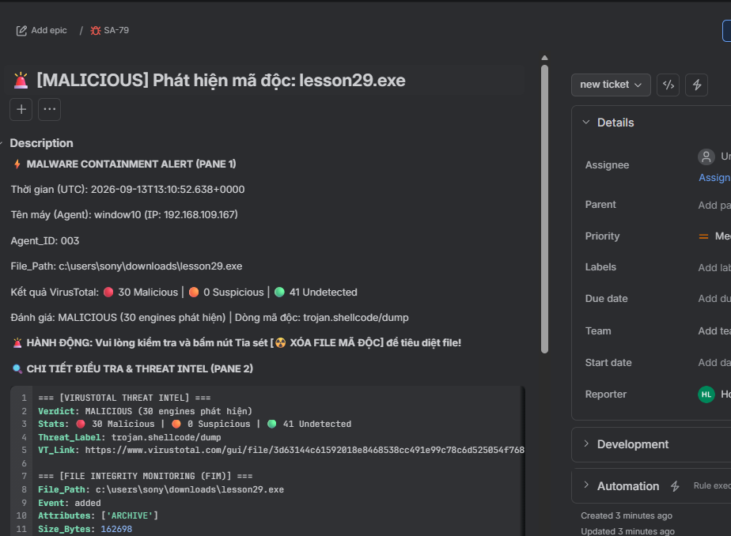
*(Highlights: 🔴 **30 Malicious engines**, Classification `trojan.shellcode/dump`, and 1-click action instructions).*

* **Pane 2 (Cryptographic Hashes & Technical Telemetry):**
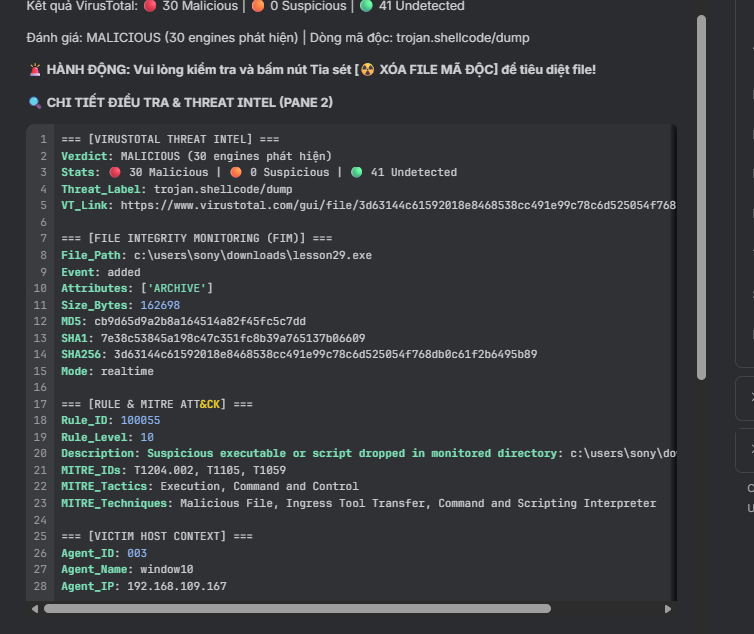
*(Contains full cryptographic hashes including SHA256 `3d63144c...` and rule metadata).*

---

#### Step 4: AI Copilot Incident Triage (Google Gemini)
The analyst invokes `AI_support`. Google Gemini evaluates the VirusTotal score and file location, delivering an urgent assessment:

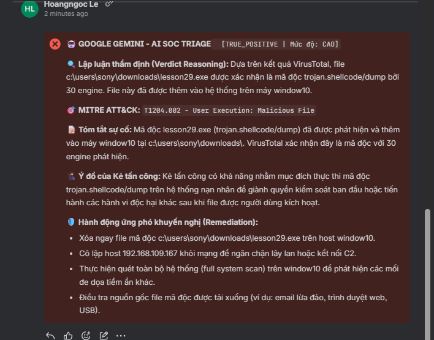
* **Verdict:** 🛑 `[TRUE_POSITIVE | Severity: HIGH]`
* **Technical Reasoning:** 30 security engines confirm `trojan.shellcode/dump`. The file dropped into `Downloads` represents an immediate risk of user execution.
* **Remediation Plan:** Immediate host-level file eradication and system scanning.

---

#### Step 5: Human-in-the-Loop Containment Authorization
With verified threat intelligence from VirusTotal and Gemini, the SOC Analyst clicks **⚡ Automation ➡️ `delete_window_file_to_shuffle`**:

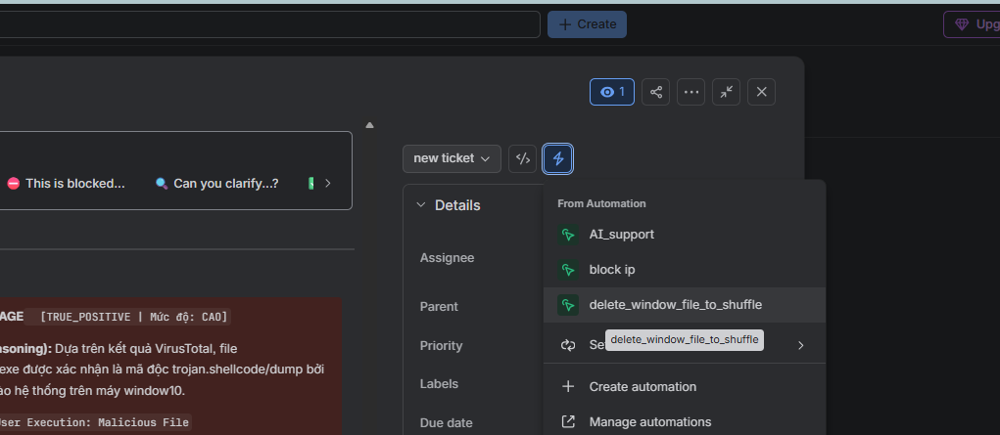

---

#### Step 6: Containment Verification & Automated Closure
Upon receiving the authorization webhook, Shuffle triggers Wazuh Active Response (`remove-threat.cmd`), cleanly deleting the payload:

* **Proof of Eradication (File Explorer shows `lesson29.exe` completely removed):**
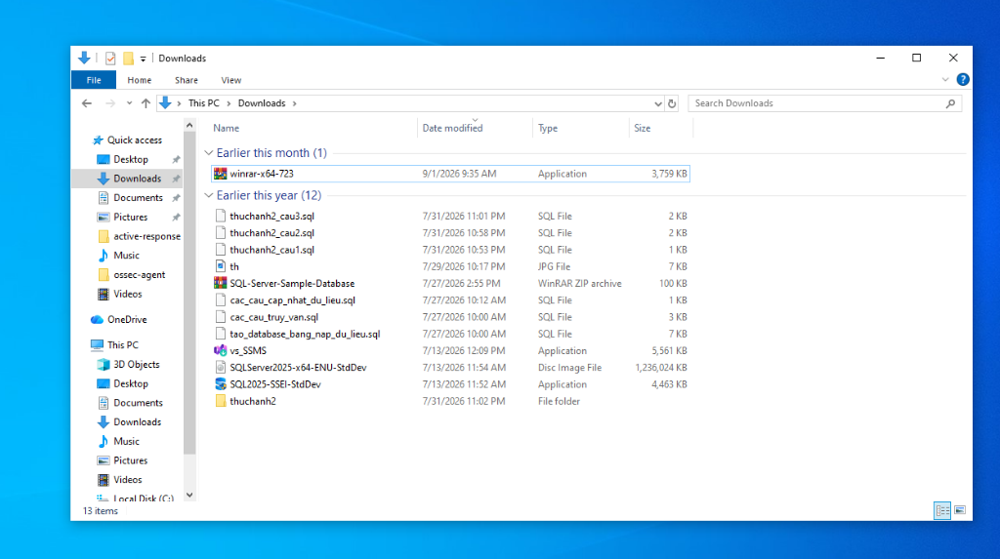

* **Automated SOAR Closure Report:**
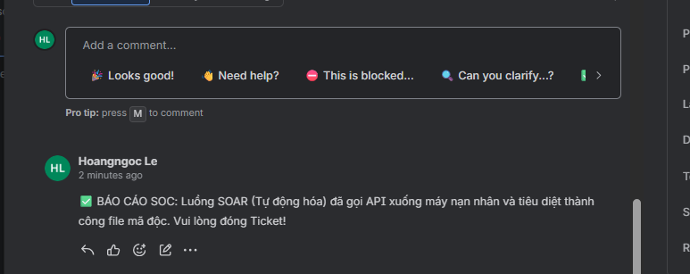
*(Confirmation comment: `✅ SOC REPORT: SOAR automated workflow invoked Active Response API on victim host and successfully eradicated malicious file. Please close the ticket!`).*

---

### Part B: SOAR Condition-Based Noise Suppression (Benign Case: HWiNFO64)

In enterprise environments, users routinely download legitimate utilities. If a SIEM or SOAR pipeline creates incident tickets for every new executable, Tier 1 analysts drown in alert fatigue. This lab introduces an automated **CTI Gatekeeper Condition** inside Shuffle SOAR to halt non-malicious events.

#### Step 7: Downloading Legitimate Software (`HWiNFO64.exe`)
A user downloads and unpacks a trusted hardware diagnostic utility (`hwi_834.zip` containing `HWiNFO64.exe`):

* **Legitimate Executable in Downloads:**
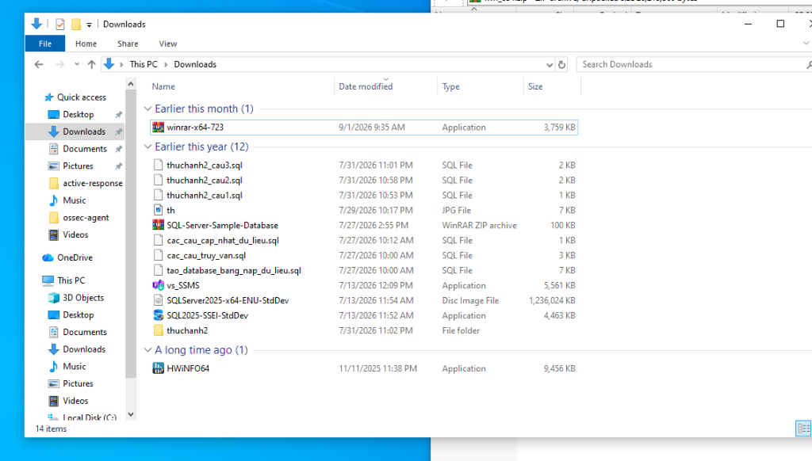

* **Extracting Archive (`hwi_834.zip`):**
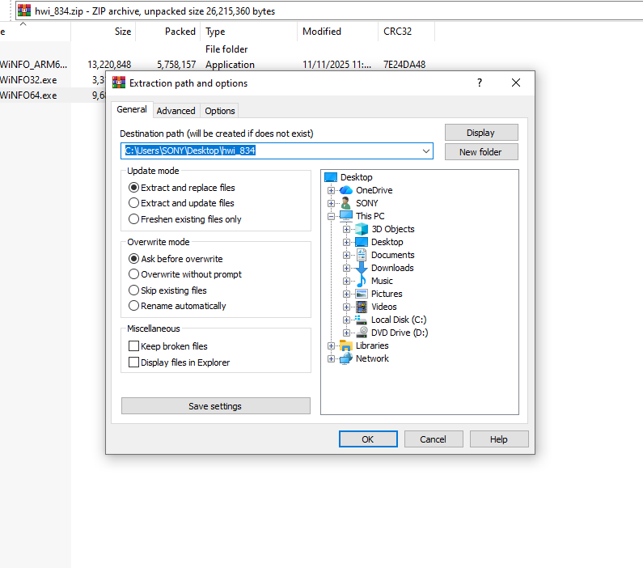

---

#### Step 8: SIEM FIM Alerting
Wazuh FIM faithfully records the file creation event and dispatches a webhook to Shuffle SOAR:

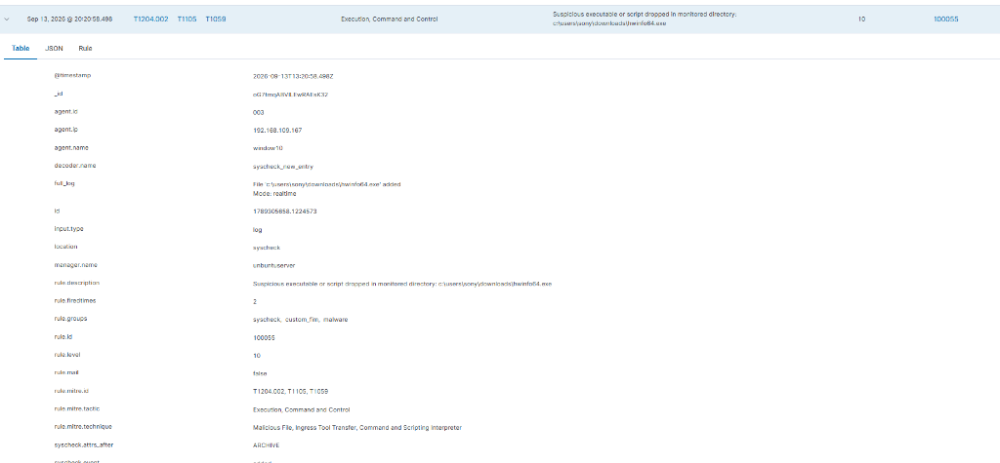
*(Log: `File 'c:\users\sony\downloads\hwinfo64.exe' added Mode: realtime`).*

---

#### Step 9: SOAR Condition Gatekeeper Halts Noise
Shuffle SOAR queries VirusTotal. Because `HWiNFO64.exe` is clean, VirusTotal returns `malicious: 0`.

The SOAR **Condition Node (`$virustotal_v3_1...malicious LARGER THAN 0`)** evaluates to **FALSE**:

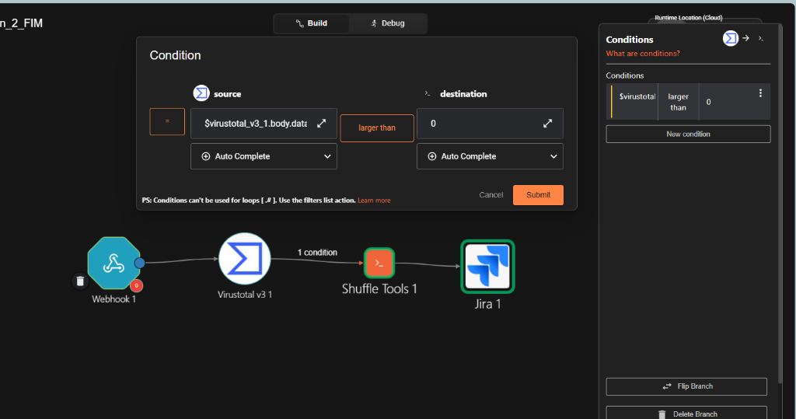

* **Architectural Impact:** The execution pipeline terminates immediately at the condition node. **No Jira ticket is created**, completely eliminating false alarm fatigue at the orchestration layer before any human attention is wasted.

---

## ⚙️ Configuration Files & Code References

* **Wazuh FIM Rule:** [`configs/wazuh/local_rules.xml`](../../configs/wazuh/local_rules.xml) (`Rule ID: 100055`)
* **Wazuh Integration Hook:** [`configs/wazuh/ossec_integration.xml`](../../configs/wazuh/ossec_integration.xml)
* **Wazuh Active Response Command:** [`configs/wazuh/ossec_active_response.xml`](../../configs/wazuh/ossec_active_response.xml)
* **Wazuh Agent FIM Monitoring:** [`configs/wazuh/ossec_agent_inputs.xml`](../../configs/wazuh/ossec_agent_inputs.xml)
* **Windows Active Response Script:** [`scripts/active_response/remove-threat.cmd`](../../scripts/active_response/remove-threat.cmd)
* **AI SOC Prompt System:** [`prompts/soc_analyst_l3_prompt.md`](../../prompts/soc_analyst_l3_prompt.md)

---

[⬅️ Back to Main Repository Overview](../../README.md)
